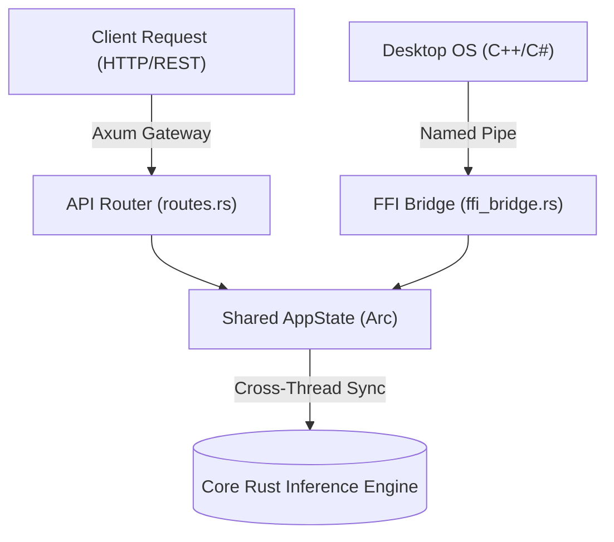

<h1 align="center">
  <picture>
    <source srcset="https://fonts.gstatic.com/s/e/notoemoji/latest/1fabc/512.webp" type="image/webp">
    
  </picture> 
  cluaiz Inference Engine
</h1>
<h3 align="center">The Cognitive Core</h3>
<p align="center"><strong>A Zero-Latency, Hardware-Native Local Inference Runtime</strong></p>

<p align="center"> 
  <a href="https://www.rust-lang.org/"></a>
  <a href="LICENSE"></a>
  <a href="https://cluaiz.com"></a>
</p>

---

The **cluaiz Inference Engine** is the bare-metal execution environment for running highly quantized Local Large Language Models (LLMs), Vision Models, and Embedded WASM Skills entirely on edge devices. It is built natively in **Rust** to bypass high-level bottlenecks and extract maximum FLOPS from consumer-grade CPUs and GPUs.

## 🏛️ Deep Architectural Mechanics

### 1. The Axum Gateway & FFI Bridge
The engine operates on a split-architecture model to ensure safety and maximum throughput:
- **The Gateway (`api/`)**: An async Axum HTTP server that receives incoming standard requests (OpenAI-compatible) and translates them into internal structural payloads.
- **The Native FFI Listener**: A low-latency named pipe / socket listener designed specifically for Desktop and OS-level integrations that require zero-overhead communication.



### 2. Autonomous Hardware Calibration
Unlike traditional inference wrappers, cluaiz does not require manual flag tuning (e.g., `-t 8 -ngl 33`). The engine utilizes the `HardwareDetector` to autonomously probe:
- SIMD instructions (AVX2, AVX-512).
- VRAM availability across discrete GPUs.
- OS-level memory locks (Huge Pages).
It then automatically compiles the optimal execution graph before the first token is generated.

## 📂 Core Crate Topology

| Directory | Core Purpose |
|-----------|--------------|
| `api/`    | The external HTTP and FFI gateway. Manages connection state, CORS, and request parsing. |
| `engines/`| The heavy computational engine. Manages LMDB memory, tensor math, and active token streaming. |
| `shared/` | The `cluaiz-shared` crate containing standard structural DNA shared across the workspace. |

---

## 🚀 Execution & Deployment

**Run the HTTP Gateway:**
```bash
cargo run -p api --release
```

**Run Hardware Diagnostics:**
```bash
cargo run -p engines --bin hardware_probe
```
