# Component: Inference API Gateway (`inference-engine/api`)

## Technical Specification
- **Purpose:** Exposes a high-performance HTTP/SSE and IPC gateway for routing client requests, CEL commands, and token streams to the cluaiz inference core. It strictly acts as a "Dumb Router", pushing database and logic overhead to CEL Extensions.
- **Platform Support:** Windows, Linux, macOS
- **Reusability Level:** High (Core Subsystem Gateway)

## Architectural Flow

```mermaid
graph TD
    A["Incoming API Request"] --> B["Axum Router (routes.rs)"]
    
    B --> C{"Request Type"}
    C -->|Chat| D["chat.rs (SSE Stream)"]
    C -->|CEL API| E["cel_handler.rs"]
    C -->|File Ingestion| F["ingest.rs"]
    
    D -->|Intercept <TRIGGER>| G["Inject SKILL.md"]
    D -->|Stream| H["User Client"]
    
    F -->|embedding_dispatcher| I["Vector Chunks"]
    I -->|Generates| J["CEL Manifest (JSON)"]
    J --> E
    
    E -->|Execute| K["cluaiz-db Extension (via FFI/IPC)"]
    
    style A fill:#444,stroke:#fff
    style E fill:#2ca02c,color:#fff
    style K fill:#ff7f0e,color:#fff
```

## API Contract (Interface)
- **Props/Struct/Trait:** `AppState`, `execute_chat`, `execute_cel_script`, `file_ingest`
- **Export Type:** Public Module (`axum` Router)
- **Dependencies:** `axum`, `tokio`, `inference-cel`, `dispatcher-crate`, `cluaizdb`

## Deep File Breakdown
- `chat.rs`: 
  - **Logic:** Inference & Token Streaming logic (SSE).
  - **Flow:** Intercepts `<TRIGGER:X>` tokens natively for the Two-Step Discovery RAG loop to load `SKILL.md` dynamically.
- `cel_handler.rs`: 
  - **Logic:** Pure CEL Execution API (`/v1/cel/execute`).
  - **Flow:** Transpiles CEL to VRAM/IPC payloads and triggers `UnifiedExecutor`. Replaces all hardcoded DB logic.
- `ingest.rs`:
  - **Logic:** File Vectorization Engine.
  - **Flow:** Uses `embedding_dispatcher` to chunk and embed documents, then dynamically generates a CEL script and hands it off to `cel_handler.rs` to insert into `cluaiz-db`. Hardcoded `save_context` LMDB calls are permanently eradicated.
- `skills.rs`: 
  - **Logic:** Extension Hub Manager (`/v1/skills/*`).
  - **Flow:** Used to fetch, install, and wipe native/WASM plugin caches.

## Failure & Recovery Logic
- **Potential Failure Point:** `dispatcher` FFI loop crashes due to OOM or bad plugin binary, blocking the SSE stream.
- **Recovery Logic:** The API SSE loop relies on atomic `cancel_flag` interceptions. If the native stream yields a `<TRIGGER>` abort or a raw error, Tokio catches the interrupt, injects the required schema (e.g., `SKILL.md`), and restarts the `dispatch_stream` loop safely without panicking the Axum router.
