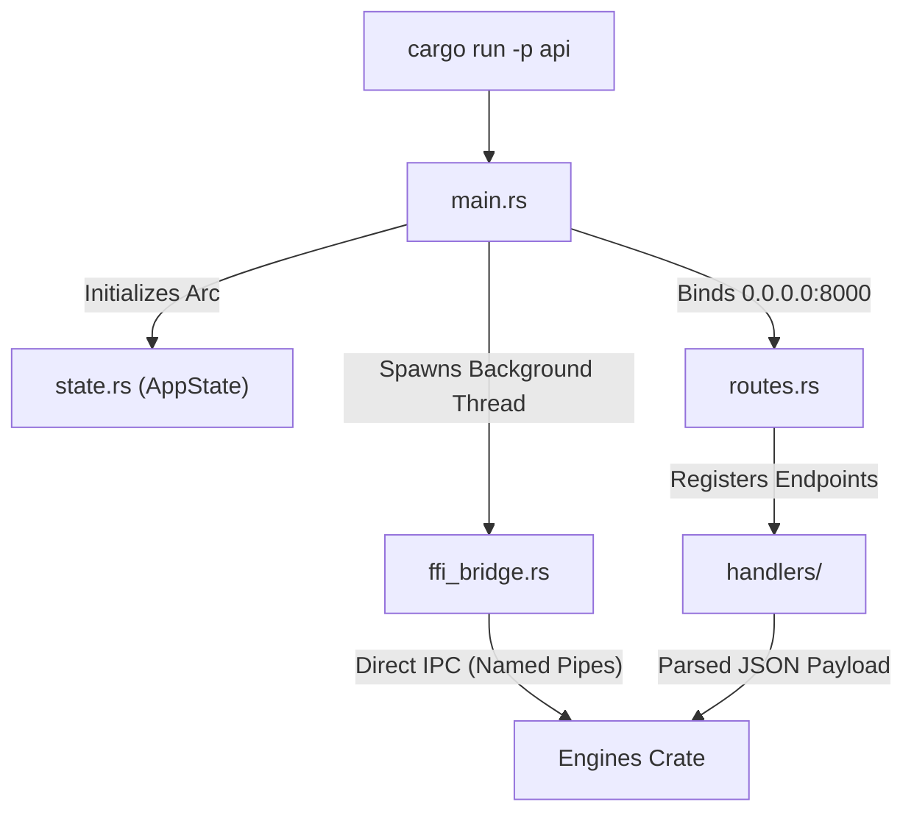

# 🌐 API Source Root (`api/src/`)

<strong>The Axum Gateway & Bootstrapper</strong>

---

## 🎯 Deep Purpose

The `api/src/` directory is the core entry point for the cluaiz Engine's HTTP and FFI Gateway. While the `engines/` crate performs all the heavy mathematical lifting and memory management, this module is strictly responsible for network I/O, route registration, CORS policies, and process initialization. 

It acts as the strict boundary between the unsafe external world (network requests) and the safe internal execution substrate (`cluaiz-shared` types).

## 🏛️ Architectural Flow

## 🧬 Significant Files

### 1. `main.rs`
- **The Core Logic:** The primary `async fn main()` powered by Tokio. It loads the `.env` configuration, boots the `HardwareDetector` to calibrate the system, spawns the FFI listeners, and finally binds the Axum web server to the network port.
- **The "Why":** Centralizes the engine boot sequence. If the engine fails to detect valid physical RAM, `main.rs` gracefully aborts before the network port is even opened, preventing zombie API instances.

### 2. `routes.rs`
- **The Core Logic:** Centralized router configuration. Applies CORS middleware and maps specific HTTP paths (e.g., `/v1/chat/completions`) to their respective handler functions.
- **The "Why":** Keeping routing logic separated from handler execution makes auditing the API surface area trivial. Developers can see every single available endpoint in one file without searching through deeply nested directories.

### 3. `state.rs`
- **The Core Logic:** Defines the `AppState` struct, an `Arc`-wrapped global context that holds database connections, active model references, and the global `ObservableHardwareState`.
- **The "Why":** Axum handlers are stateless by design. `AppState` safely allows concurrent web requests (like a chat stream and a dashboard poll) to read the same underlying hardware state without triggering data races.

### 4. `ffi_bridge.rs`
- **The Core Logic:** Bypasses HTTP entirely. Implements Named Pipes (Windows) and Unix Domain Sockets (Linux). It also **actively monitors the LLM's token stream** for `<cel>` tags to intercept Engine Directives mid-inference.
- **The "Why":** 
  - The upcoming cluaiz Desktop App requires 0-latency communication with the engine.
  - **Dynamic AI Agency (JIT Injection):** By intercepting `<cel>` tags, the engine can execute raw scripts natively (like injecting data into the Mid-Layer) without streaming the command to the user, allowing the AI to dynamically correct itself during inference.
