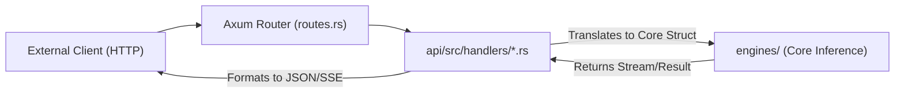

# 🌐 Axum Route Handlers (`api/src/handlers/`)

<strong>The External Request Translators</strong>

---

## 🎯 Deep Purpose

The `handlers/` directory is the edge layer of the cluaiz inference engine. When external clients (Desktop UIs, Web Dashboards, or OpenAI-compatible scripts) send HTTP REST requests, those requests land here. 

The strict architectural rule of this module is that **handlers contain zero core business logic**. They are purely translation layers. A handler's only job is to:
1. Parse the incoming JSON/Multipart payload via Axum.
2. Validate the structural schema (JWT tokens, parameter boundaries).
3. Translate the HTTP request into a `cluaiz_shared` internal Rust struct.
4. Dispatch that struct safely to the inner `engines/` core for execution.

## 🏛️ Architectural Flow

## 🧬 Significant Files

### 1. `chat.rs`
- **The Core Logic:** Handles `/v1/chat/completions` (OpenAI format) and `/chat` (Legacy cluaiz format).
- **The "Why":** Standardizes incoming prompts. Converts HTTP Server-Sent Events (SSE) subscriptions into internal MPSC channel listeners to stream tokens back to the browser in real-time.

### 2. `models.rs`
- **The Core Logic:** Handles model registry requests (`/api/tags`, `/models/download`).
- **The "Why":** When a user asks to download a 20GB GGUF model, this handler spawns the async download task within the Engine and immediately returns a 202 Accepted response, preventing the HTTP socket from timing out.

### 3. `system.rs` & `booster.rs`
- **The Core Logic:** Handles engine configuration (`/health`, `/hardware`, `/v1/booster/update`).
- **The "Why":** Provides endpoints for the Desktop App to dynamically toggle HugePages or AVX-512 offloading without restarting the engine process.

### 4. `skills.rs` & `db.rs`
- **The Core Logic:** Routing for WASM Skill installation and CDQL Database execution.
- **The "Why":** Allows the inference engine to dynamically install new `.wasm` plugins via HTTP POST requests, securely saving them to the `.cluaiz/skills/` directory.

### 5. `cel_handler.rs` (The Hardcore Control Gateway)
- **The Core Logic:** Handles the `/v1/cel/execute` endpoint. Parses raw CEL (cluaiz Expression Language) strings and routes them directly to the `NativeExecutor` or native Engine Memory Hooks.
- **The "Why":** Eliminates the need for pre-compiled plugins by allowing external clients (like Docker nodes) to control the engine natively. Enables Direct Memory Control (`kv_cache -> clear`) and Mid-Layer Injection (`mid_layer -> inject`) via pure scripting.
