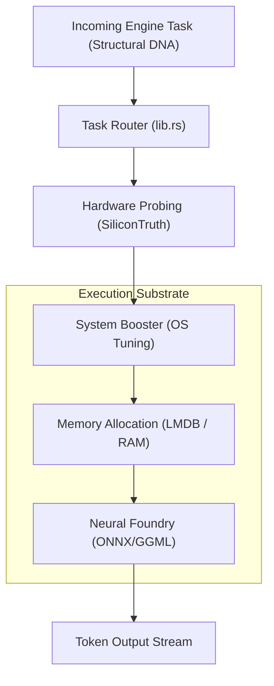

# ⚙️ Core Engines Crate (`engines/`)

<strong>The Bare-Metal Computation Engine</strong>

---

## 🎯 Deep Purpose

The `engines` crate is the absolute computational heart of the cluaiz inference ecosystem. While the `api` crate merely parses network requests, the `engines` crate physically executes them. It is responsible for memory mapping (LMDB), OS-level hardware negotiation, tensor layer offloading, and the real-time execution of neural network token generation.

This crate is built to be completely decoupled from HTTP—it operates purely on in-memory Rust structures (`cluaiz-shared`), allowing it to be compiled directly into desktop apps, mobile platforms, or backend servers without modification.

## 🏛️ Architectural Flow

The engine operates on a reactive, event-driven pipeline that prioritizes lock-free memory access:

## 🧬 Significant Subsystems & Files

### 1. `src/` (The Main Module Tree)
Contains all internal sub-crates like `memory/` (for managing massive 32k+ token LMDB context windows), `hardware/` (for detecting AVX-512 and VRAM limits), and `neural_foundry/` (the bridge to C/C++ matrix multiplication engines).

### 2. `system-booster/`
An independent sub-crate that interacts deeply with the operating system kernel (Windows APIs / Linux `madvise`). It locks HugePages and escalates thread priority to ensure inference is not stalled by background OS tasks.

### 3. `build.rs` & `booster_build.ps1`
- **The Core Logic:** Custom build scripts executed before Rust compilation.
- **The "Why":** These scripts compile the underlying C/C++ native code (like Flash Attention kernels or GGML backends) and link them dynamically to the Rust binaries depending on the target OS (Windows vs Linux).
