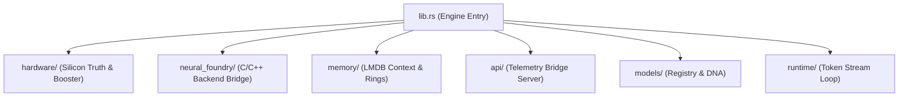

# 📂 Engine Source Tree (`engines/src/`)

<strong>The Master Module Router & Core Architecture</strong>

---

## 🎯 Deep Purpose

The `engines/src/` directory is the root of the Rust module tree for the cluaiz inference engine. By strictly segregating the engine into distinct functional modules (Memory, Hardware, Neural Foundry, Telemetry), we guarantee that hardware detection logic can be audited independently of token streaming, and memory allocation bugs do not crash the REST gateway.

This directory structures the exact execution sequence of an inference task from the moment it leaves the HTTP layer to the moment it hits physical GPU VRAM.

## 🏛️ Architectural Hierarchy

## 🧬 Significant Directories & Modules

### 1. `lib.rs`
- **The Core Logic:** The fundamental entry point that registers all sub-modules and dictates structural visibility. 
- **The Execution Flow:** Initializes the global `ObservableHardwareState` and boots the underlying execution threads before accepting commands.

### 2. `api/` (Telemetry Bridge)
- **The Core Logic:** A naked Tokio TCP listener serving the engine dashboard and live hardware metrics with 0.0ms overhead. **Not** the HTTP REST Gateway.

### 3. `hardware/` & `platform/`
- **The Core Logic:** Probes physical silicon (AVX/AVX2/AVX-512, CUDA cores, NUMA nodes) and executes OS-specific configurations (Windows vs Linux).
- **The "Why":** Standard LLM wrappers rely on manual user flags. cluaiz uses `hardware/` to autonomously configure the execution graph perfectly for the host machine.

### 4. `memory/`
- **The Core Logic:** Manages the LMDB memory-mapped KV cache and conversational session rings.
- **The "Why":** Offloads 32k+ token contexts to disk-backed memory mapped files, preventing the engine from crashing when RAM is fully exhausted during long chats.

### 5. `neural_foundry/`
- **The Core Logic:** The interface bridging high-level Rust logic to the underlying low-level tensor matrix multiplication operations (GGML / ONNX).

### 6. `runtime/`
- **The Core Logic:** Contains the main inference loop, managing context ingestion, attention calculations, and the active token streaming logic back to the client.

### 7. `bin/` & `cli/`
- **The Core Logic:** Standalone executable binaries (`gen_roster`, `hardware_probe`) that allow internal module testing and JSON registry generation without booting the entire server.
