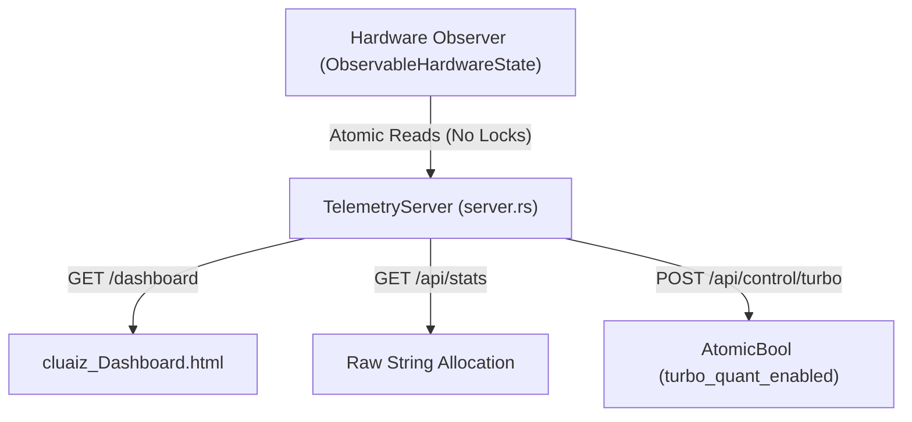

# 📡 cluaiz Telemetry Bridge (`engines/src/api/`)

<strong>Bare-Metal HTTP Telemetry Server</strong>

---

## 🎯 Deep Purpose

The `engines/src/api/` directory is **NOT** the external HTTP gateway (that lives in the top-level `api/` crate). Instead, this is the internal **cluaiz Telemetry Bridge (Archer Server)**. 

When tracking real-time hardware inference metrics (like VRAM pressure, KV Cache footprint, and per-core relay latency), standard web frameworks like Axum introduce unacceptable memory overhead and thread contention. This module implements a raw, framework-free HTTP server directly on top of `tokio::net::TcpListener` to serve live dashboards with exactly **0.0ms engine impact**.

## 🏛️ Architectural Flow

## 🧬 Significant Files

### 1. `server.rs`
- **The Core Logic:** A naked `TcpListener` loop. Parses HTTP headers manually and writes raw socket byte responses. 
- **The "Why":** Bypassing HTTP framework abstractions prevents deep heap allocations. When querying stats 60 times a second, creating Rust Structs and serializing them via Serde is too slow. This file uses pure atomic string formatting.

### 2. `cluaiz_Dashboard.html`
- **The Core Logic:** The native UI dashboard embedded directly into the compiled binary via `include_str!()`.
- **The "Why":** Provides engineers with an instant visual readout of engine health without requiring a Node.js frontend.

### 3. `router.rs`
- **The Core Logic:** Fast-path string matching for incoming TCP streams to route to the correct atomic hardware read function.
