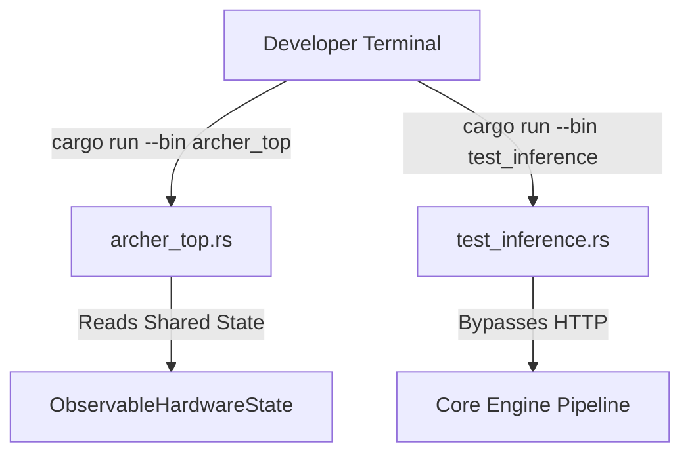

# 🛠️ Engine Toolchain (`engines/src/bin/`)

<strong>Standalone Executables & Diagnostic Binaries</strong>

---

## 🎯 Deep Purpose

The `bin/` directory contains standalone Rust executables (`[[bin]]` targets in `Cargo.toml`). These are distinct from the primary `inference-engine` daemon. 

When building a low-level memory-mapped tensor engine, developers frequently need to test specific functions (like loading a 10GB model into VRAM or checking CPU registers) without booting the entire HTTP API Gateway. This directory provides the isolated diagnostic tools required to maintain and debug the engine.

## 🏛️ Architectural Flow

## 🧬 Significant Files

### 1. `archer_top.rs`
- **The Core Logic:** A terminal-based (TUI) system monitor specifically built for the cluaiz inference engine.
- **The "Why":** Standard `htop` or Task Manager cannot see internal KV Cache memory pressure or engine-specific latency spikes. `archer_top` reads the raw atomic values from the `ObservableHardwareState` to provide a real-time, 0.0ms overhead dashboard for developers tracking VRAM leaks.

### 2. `gen_roster.rs`
- **The Core Logic:** A JSON manifest generation script.
- **The "Why":** Manually writing JSON files for 50+ models (specifying parameters, quantization modes, and file hashes) is error-prone. This binary programmatically generates the `models/library/*.json` definitions ensuring strict schema compliance.

### 3. `test_inference.rs` & `verify_loading.rs`
- **The Core Logic:** Pure execution scripts that bypass the web server and load the engine libraries directly.
- **The "Why":** If a user reports that a model crashes during generation, developers use these scripts to run the model directly in a terminal. If it crashes here, it's a backend/hardware issue. If it works here but fails on the web server, it's an API routing bug.

### 4. `legacy/` & `patch_bonsai.rs`
- **The Core Logic:** Migration and patching utilities for older model formats.
- **The "Why":** Over time, model architectures change. These scripts exist to safely upgrade older databases or JSON files without breaking user configurations.
