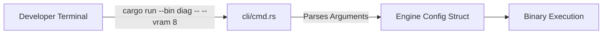

# ⌨️ Command Line Interface (`engines/src/cli/`)

<strong>Internal Engine CLI Argument Parser</strong>

---

## 🎯 Deep Purpose

The `cli/` module handles the parsing and execution of terminal commands passed directly to the `engines` binaries. While the main HTTP server has its own CLI, the standalone binaries located in `engines/src/bin/` (like `hardware_probe` or diagnostic tools) rely on this module to parse command-line flags.

## 🏛️ Architectural Mechanics

## 🧬 Significant Files
### 1. `cmd.rs` & `mod.rs`
- **The Core Logic:** Utilizes `clap` or native matching to route flags to configuration settings.
- **The "Why":** Provides a standardized interface for developers interacting with internal engine utilities without needing to hardcode variables.
