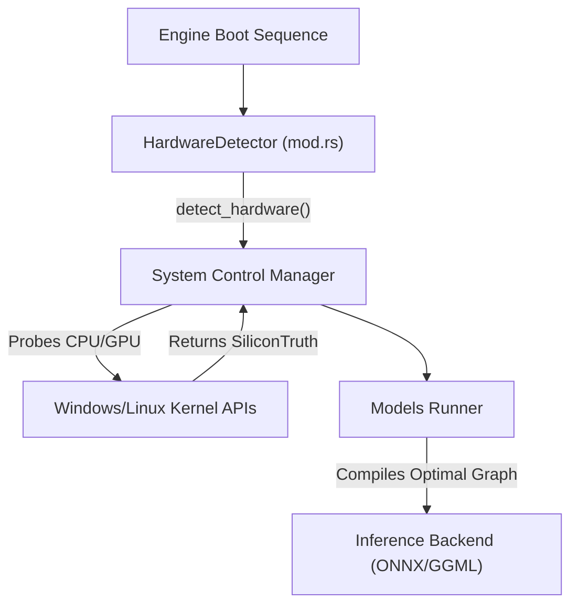

# ⚙️ Silicon Truth & Hardware Probing (`engines/src/hardware/`)

<strong>Autonomous System Negotiation Subsystem</strong>

---

## 🎯 Deep Purpose

The `hardware/` module acts as the physical layer interface for the cluaiz Inference Engine. Traditional LLM execution environments (like `llama.cpp` or Ollama) often require users to manually specify execution flags: how many threads to use, how many layers to offload to the GPU, or whether AVX2 is available. 

This module eliminates manual configuration by executing the **SiliconTruth** protocol. It drops down to the OS API to actively probe the physical CPU registers, enumerate available GPU memory architectures, and analyze NUMA nodes before the engine boots.

## 🏛️ Architectural Flow

## 🧬 Significant Files

### 1. `mod.rs` (The HardwareDetector)
- **The Core Logic:** Re-exports the `SiliconTruth` structures defined in the `cluaiz-shared` crate and implements the `HardwareDetector` bootloader.
- **The Execution Flow:** Called during engine initialization. It blocks the main thread until it successfully constructs a topological map of the physical hardware.

### 2. `system_control_manager.rs`
- **The Core Logic:** The actual physical probing implementation. Uses low-level CPU identification (CPUID) and system memory polling functions to read physical RAM capacity, AVX-512 support, and GPU availability.
- **The "Why":** If the engine attempts to run AVX-512 tensor math on an older CPU, the process will trigger an illegal instruction fault (`SIGILL`) and crash instantly. This file prevents that by strictly capping the inference runner to supported hardware instruction sets.

### 3. `models_runner.rs`
- **The Core Logic:** The execution orchestrator. Takes the `SiliconTruth` generated by the `System Control Manager` and decides which backend runner (`cluaiz`, `Llama`, or `Candle`) is mathematically optimal for the user's specific silicon.
- **The "Why":** A system with a massive Nvidia RTX 4090 requires a completely different execution pipeline (CUDA) than a constrained Intel Celeron laptop (CPU fallback). This file dynamically routes the execution stream to the correct math library at runtime.
