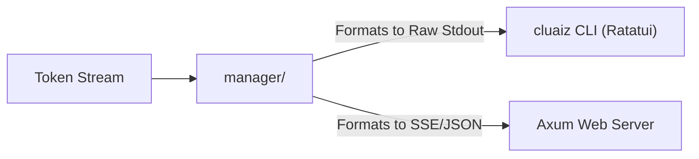

# 🔗 Interface Engines Bridge (`engines/src/interface-engines/`)

<strong>The Multi-Frontend Binding Subsystem</strong>

---

## 🎯 Deep Purpose

The cluaiz ecosystem is not just a single binary—it powers CLI tools, Desktop Applications, and Web interfaces. The `interface-engines/` module within the core Rust `engines` crate is strictly responsible for managing the bridging logic between the raw computation engine and these higher-level "Interface Engines".

It ensures that the output format of the token stream matches the specific protocol expected by the consuming interface (e.g., raw byte stream for the CLI, Server-Sent Events (SSE) for the Web GUI).

## 🏛️ Architectural Flow

## 🧬 Significant Subsystems

### 1. `manager/`
- **The Core Logic:** Implements the connection pooling and formatting manager for active interface clients.
- **The "Why":** A CLI tool expects tokens to be flushed to `stdout` instantly, whereas a Web UI expects structured JSON chunks. This manager abstracts the output destination, allowing the Neural Foundry to just "yield token" without worrying about *who* is receiving it.
