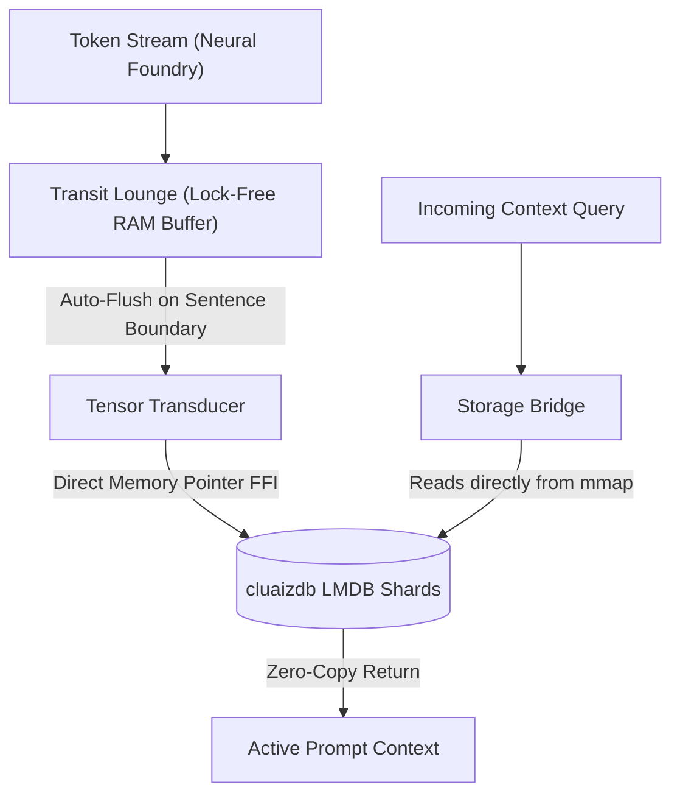

# 🧠 Memory Matrix (`engines/src/memory/`)

<strong>Zero-Latency Context Caching & State Management</strong>

---

## 🎯 Deep Purpose

The `memory/` module is responsible for managing the state, context windows, and streaming outputs of the cluaiz inference engine. Because LLMs generate text token-by-token at high speeds, saving every single token directly to a traditional database or disk file would cause catastrophic SSD thrashing and IO bottlenecks.

Instead, this module implements a **3-Tier Storage Hierarchy** using lock-free RAM buffers (Transit Lounge) and direct memory-mapped FFI bridging to the underlying `cluaizdb` LMDB database. It handles chat history, KV caching, and embedding injection without pausing the active neural generation thread.

## 🏛️ Architectural Flow

## 🧬 Significant Files

### 1. `transit.rs` (The Transit Lounge)
- **The Core Logic:** Implements a lock-free `mpsc` channel ring buffer for unconfirmed tokens.
- **The Execution Flow:** As tokens are generated, they are pushed into the Transit Lounge. The buffer automatically flushes to SSD in batches—either when a semantic boundary is reached (like a period `.` or `\n`), or when RAM limits are exceeded.
- **The "Why":** Prevents disk IO bottlenecks and SSD degradation while ensuring that a sudden crash only loses an incomplete sentence, not the whole conversation.

### 2. `tensor_transducer.rs`
- **The Core Logic:** The core integration point between the Engine and the `cluaizdb` LMDB database. Uses C-FFI to call `cluaizdb_ffi_execute_parameterized`.
- **The Execution Flow:** Rather than serializing memory to JSON and making an HTTP call to the database, the transducer passes raw native memory pointers (`*mut c_void`) across the boundary.
- **The "Why":** Achieves true 0.0ms latency for database writes, ensuring the token stream is never blocked by database serialization overhead.

### 3. `storage_bridge.rs` & `local_bridge.rs`
- **The Core Logic:** High-level abstractions that decide if the engine should write to a local LMDB file, or send the state over the network to a remote cluaiz instance.

### 4. `kv_injector.rs`
- **The Core Logic:** Manages the KV Cache (Key-Value Attention Cache) swapping. When a conversation exceeds VRAM capacity, this module strips the oldest KV tensors and pages them to disk, re-injecting them seamlessly when needed.
