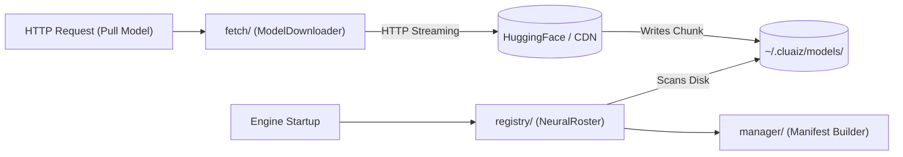

# 📦 Model Manager (`engines/src/models/`)

<strong>Local AI Vault & Registry Subsystem</strong>

---

## 🎯 Deep Purpose

The `models/` directory acts as the central Vault for all physical AI models. Because the Cluaiz Engine operates entirely offline on the edge, it cannot rely on cloud endpoints for model data. This module is responsible for discovering, downloading, validating, and cataloging local `.gguf`, `.safetensors`, and `.onnx` files located on the user's hard drive.

## 🏛️ Architectural Flow

## 🧬 Significant Directories & Files

### 1. `registry/`
- **The Core Logic:** Implements the `NeuralRoster` which scans the local `~/.cluaiz/models/` folder and the workspace `models/library/` folder.
- **The "Why":** The engine needs to know exactly which models are installed before starting inference. This directory loads the structural JSON manifests (defining context size, quantization, and parameters) and links them to the physical binary files on disk.

### 2. `fetch/`
- **The Core Logic:** The `ModelDownloader` system. Uses asynchronous HTTP clients (like `reqwest`) to pull multi-gigabyte files with resumable progress tracking.
- **The "Why":** Downloading a 14GB Qwen model can fail midway due to network drops. This module handles byte-range requests to resume interrupted downloads and calculates SHA256 checksums to guarantee file integrity.

### 3. `manager/`
- **The Core Logic:** Orchestrates the lifecycle of a model. Deletes models from the vault, updates cached manifests, and resolves symbolic links.
- **The "Why":** Ensures that deleting a model from the HTTP API safely removes the massive binary files from the SSD without corrupting the active registry.
