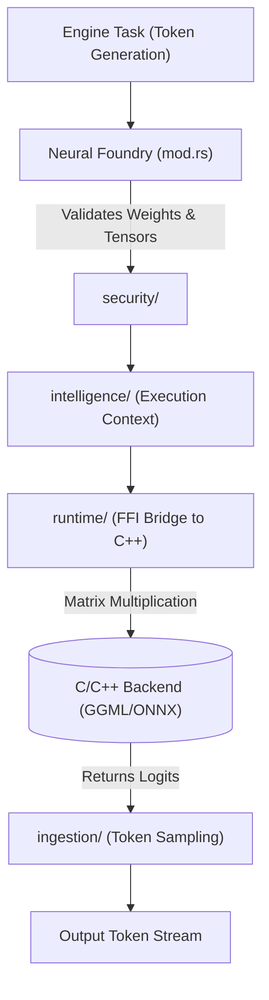

# 🧠 Neural Foundry (`engines/src/neural_foundry/`)

<strong>The Low-Level Math & Inference Backend Bridge</strong>

---

## 🎯 Deep Purpose

The `neural_foundry/` module is the heavy-lifting math execution layer of the Engine. While outer layers handle routing, HTTP requests, and structural DNA, the Neural Foundry is strictly responsible for performing tensor matrix multiplications. 

It acts as a secure, memory-safe Rust wrapper around highly optimized C/C++ backends (like `llama.cpp` for GGML or `onnxruntime` for ONNX). It ensures that a segmentation fault in a C++ tensor operation does not crash the entire Axum web gateway.

## 🏛️ Architectural Flow

## 🧬 Significant Subsystems

### 1. `runtime/`
- **The Core Logic:** Holds the unsafe FFI (Foreign Function Interface) bindings to the external C/C++ libraries.
- **The "Why":** Rust is memory safe; C++ is not. This module isolates all `unsafe {}` blocks required to pass raw memory pointers of the loaded LLM weights into the execution backend. 

### 2. `intelligence/`
- **The Core Logic:** Manages the active context window state during inference.
- **The "Why":** When streaming a 32k context conversation, the engine must keep track of KV (Key-Value) attention states. This module ensures that the memory arrays passed into the math backend are properly aligned and not overlapping.

### 3. `ingestion/`
- **The Core Logic:** Post-processing of mathematical logits. Handles Top-K, Top-P, and Temperature sampling.
- **The "Why":** The math backend only returns a raw array of probability floats (logits). The `ingestion/` module converts those raw probabilities back into actual text tokens by applying the user's selected sampling algorithms.

### 4. `security/`
- **The Core Logic:** Validates neural weights and model file integrity before loading them into VRAM.
- **The "Why":** Loading a maliciously crafted `.gguf` file could execute arbitrary code via buffer overflows in the C++ backend. This module computes hashes and structural boundaries to prevent malicious model injection.
