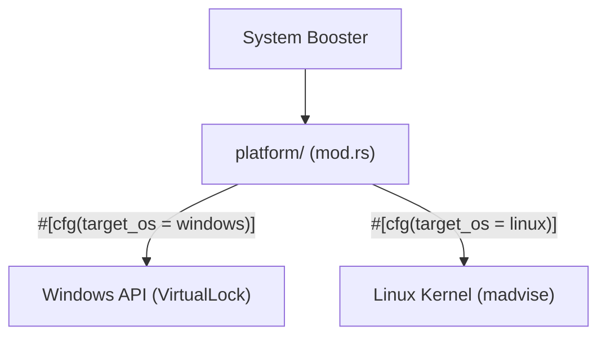

# 🖥️ Platform Abstractions (`engines/src/platform/`)

<strong>OS-Specific Execution Boundaries</strong>

---

## 🎯 Deep Purpose

The `platform/` module isolates all OS-specific unsafe FFI code. The cluaiz engine interacts heavily with low-level OS APIs (e.g., memory locking, process priority scheduling) to squeeze out maximum performance. 

Because Windows (`winapi`), macOS (`mach`), and Linux (`libc`) handle physical memory and threads completely differently, this directory abstracts those differences away behind safe Rust traits so the rest of the engine can compile universally.

## 🏛️ Architectural Flow

## 🧬 Significant Details
- **The Core Logic:** Uses conditional compilation (`#[cfg]`) to select the correct physical implementation at compile time.
- **The "Why":** Prevents OS-specific boilerplate from polluting the clean mathematical logic of the Neural Foundry. Ensures true cross-platform compatibility.
