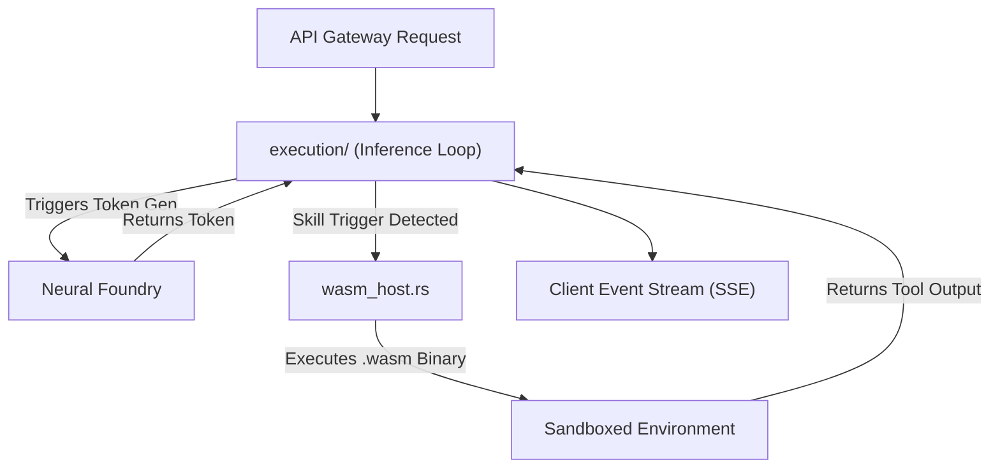

# ⏳ Active Runtime (`engines/src/runtime/`)

<strong>The Token Streaming & Execution Host</strong>

---

## 🎯 Deep Purpose

The `runtime/` module manages the active execution state of an ongoing inference job. Once a model is loaded into VRAM (by the `neural_foundry/`) and memory is mapped (by `memory/`), the `runtime/` takes over to govern the actual multi-threaded token generation loop. 

It is also responsible for hosting secondary execution environments, such as WebAssembly (WASM), allowing external Skill execution to run alongside the neural inference loop.

## 🏛️ Architectural Flow

## 🧬 Significant Directories & Files

### 1. `execution/`
- **The Core Logic:** Contains the primary asynchronous loops that drive the language model forward. It manages the context pipeline, ensuring that new prompts are properly concatenated with the LMDB-backed conversational history.
- **The "Why":** Standard blocking inference locks the entire thread until the model finishes generating 500 words. This directory implements an async-yield pattern, releasing the Tokio executor thread every few tokens so the rest of the web server can process incoming connections simultaneously.

### 2. `wasm_host.rs`
- **The Core Logic:** A sandboxed WebAssembly execution environment (typically powered by Wasmtime or Wasmer).
- **The "Why":** cluaiz natively supports "Skills" (plugins) that the LLM can trigger. Instead of running unsafe Python scripts directly on the host machine, the Engine loads compiled `.wasm` skills. The `wasm_host.rs` file restricts memory access, guaranteeing that a malicious skill cannot read system files or crash the inference engine.
