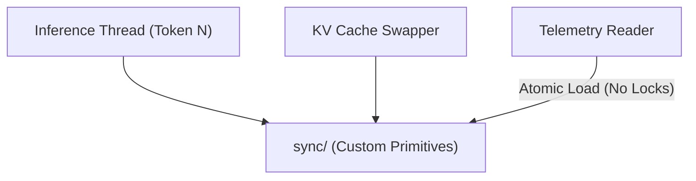

# 🔄 Synchronization Primitives (`engines/src/sync/`)

<strong>Cross-Thread Execution Locks & Concurrency</strong>

---

## 🎯 Deep Purpose

The `sync/` directory contains custom synchronization primitives and thread-safe data structures explicitly designed for the cluaiz Engine's unique threading model. 

Standard Rust `Mutex` or `RwLock` primitives are sometimes too slow or cause thread starvation when thousands of tokens are being generated per second across multiple CPU cores. This module provides atomic, lock-free, or specialized blocking mechanisms required for the high-performance Neural Foundry.

## 🏛️ Architectural Mechanics

## 🧬 Significant Subsystems
- **The Core Logic:** Defines the concurrency boundaries. If an engine state needs to be updated by the API gateway while the `runtime/` is actively streaming, the safe transaction passes through these structures.
- **The "Why":** Thread safety without compromising token generation speed. Eliminates priority inversion bugs.
