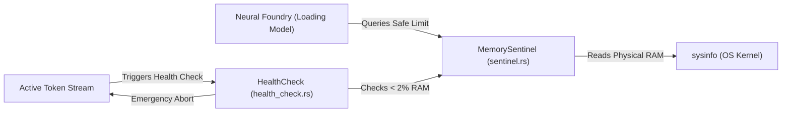

# 📡 Engine Telemetry (`engines/src/telemetry/`)

<strong>Safety Sentinels & Real-Time Metrics</strong>

---

## 🎯 Deep Purpose

The `telemetry/` module is the active monitoring and safety system of the cluaiz inference engine. Loading a multi-gigabyte neural network into physical RAM or VRAM is inherently dangerous—if the OS runs out of memory, it will trigger the OOM (Out of Memory) killer and hard-crash the entire system.

This module actively monitors system health, disk throughput, and available memory *during* inference, acting as a circuit breaker if the engine begins to consume unsafe levels of system resources.

## 🏛️ Architectural Flow

## 🧬 Significant Files

### 1. `sentinel.rs`
- **The Core Logic:** Implements the `MemorySentinel` which constantly polls `sysinfo` to calculate strictly available memory buffers.
- **The Execution Flow:** Before a 10GB model is passed to the Tensor runtime, the engine asks the Sentinel if `10GB < Available_RAM`. During inference, the Sentinel runs an "Emergency Kill Switch" check to see if system RAM drops below 2%.
- **The "Why":** Prevents catastrophic system freezes. If the engine detects a critical state, it gracefully aborts the token stream rather than letting the OS crash.

### 2. `health_check.rs`
- **The Core Logic:** Aggregates telemetry data (temperatures, swap usage) to determine if the node is "Healthy", "Degraded", or "Critical".
- **The "Why":** Required for future distributed execution. If a local node is thermal throttling, the health check will route the inference request to another node in the cluster.
