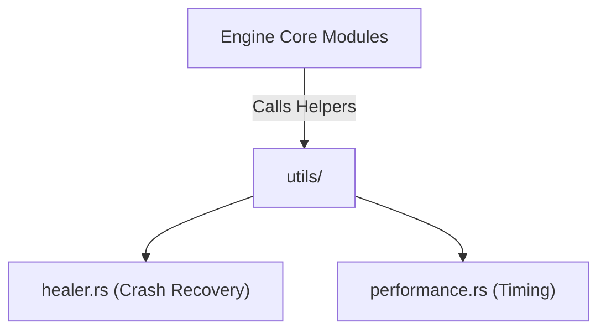

# 🛠️ Shared Engine Utilities (`engines/src/utils/`)

<strong>Pure Functions & Performance Tooling</strong>

---

## 🎯 Deep Purpose

The `utils/` directory serves as the strictly generic tooling module for the inference engine. Unlike the heavy architectural subsystems (`memory`, `hardware`), this folder contains pure, stateless helper functions that do not mutate global engine state. 

It provides the necessary scaffolding for high-resolution timing, string manipulation, and autonomous crash recovery without entangling the core execution pipeline with boilerplate code.

## 🏛️ Architectural Flow

## 🧬 Significant Files

### 1. `healer.rs`
- **The Core Logic:** Implements fallback and auto-recovery algorithms.
- **The "Why":** If a specific tensor operation panics or a thread deadlocks during generation, `healer.rs` attempts to safely unpoison the Mutexes or gracefully terminate the thread, returning an organized error to the HTTP layer instead of crashing the process.

### 2. `performance.rs`
- **The Core Logic:** High-precision timing utilities (microsecond/nanosecond resolution).
- **The "Why":** Standard `std::time::Instant` can sometimes lack the precision needed for profiling individual matrix multiplication layers. This module wraps OS-specific monotonic clocks to calculate accurate Tokens-Per-Second (TPS) metrics.
