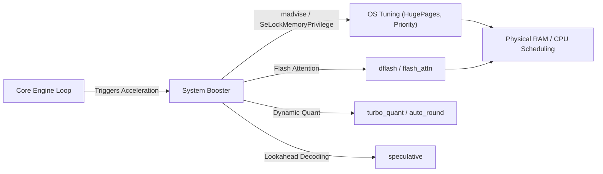

# 🚀 System Booster Crate (`engines/system-booster/`)

<strong>Deep OS & Hardware Optimization Subsystem</strong>

---

## 🎯 Deep Purpose

The `system-booster` crate is a highly specialized, low-level Rust module designed to fundamentally alter how the host operating system allocates resources during active LLM inference. 

Running a massive transformer model locally requires enormous memory bandwidth, uninterrupted thread scheduling, and optimized matrix multiplications. Standard OS schedulers (like Windows Task Scheduler) often interrupt heavy compute tasks. This crate drops down to the OS API level and the tensor level to force the system into a "Heavy Compute" state, accelerating tokens-per-second (TPS) and minimizing latency spikes.

## 🏛️ Architectural Flow

## 🧬 Significant Subsystems & Directories

### 1. `os_tuning/` & `system_booster.rs`
- **The Core Logic:** Directly interfaces with the Windows API and Linux Kernel to request elevated thread priorities and lock memory pages (`HugePages`).
- **The "Why":** Standard 4KB memory pages cause massive Translation Lookaside Buffer (TLB) misses during tensor operations. By forcing the OS to allocate 2MB or 1GB contiguous pages, CPU inference speed increases dramatically.

### 2. `flash_attn/` & `dflash/`
- **The Core Logic:** Hardware-native implementations of Flash Attention and Distributed Flash Attention.
- **The "Why":** Standard attention scales quadratically with sequence length. By fusing the attention calculation into a single hardware kernel pass, the engine avoids swapping intermediate matrices to VRAM, ensuring that 32k+ token contexts remain fast.

### 3. `turbo_quant/` & `auto_round/`
- **The Core Logic:** Real-time, dynamic quantization algorithms.
- **The "Why":** Allows the engine to downcast FP16 weights to 4-bit or 2-bit representations mathematically on the fly, drastically reducing memory bandwidth requirements on constrained edge devices without permanently altering the source model file.

### 4. `speculative/`
- **The Core Logic:** Speculative decoding / Lookahead algorithms.
- **The "Why":** Uses a smaller, faster "draft" model to predict the next $N$ tokens, while the large model verifies them in parallel. If correct, all $N$ tokens are accepted simultaneously, resulting in massive bursts of generation speed.