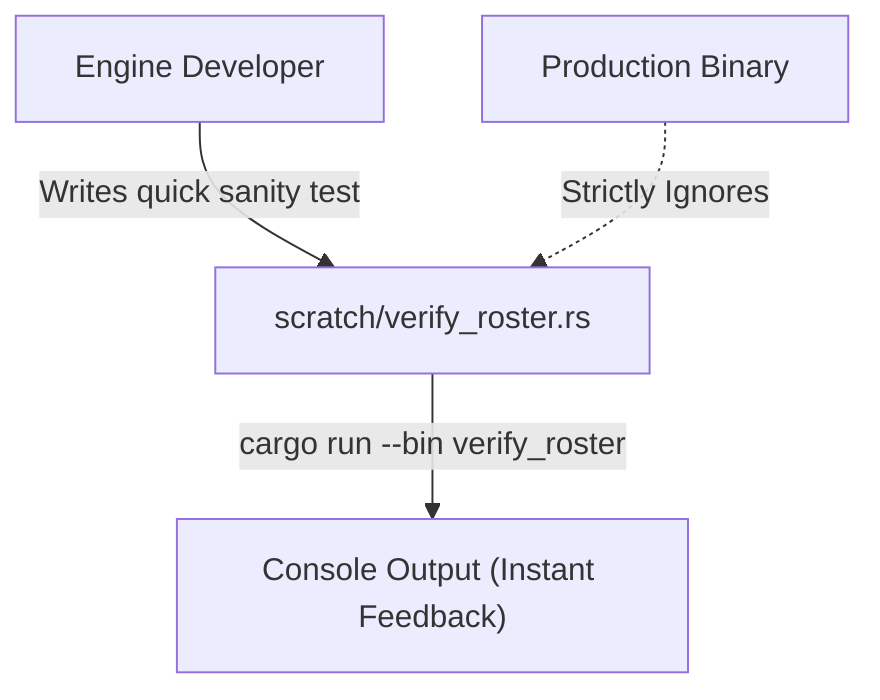

# 🧪 The Scratch Environment (`scratch/`)

<strong>Ephemeral Execution & Prototyping Zone</strong>

---

## 🎯 Deep Purpose

The `scratch/` directory is an isolated, strictly temporary testing environment for the cluaiz Inference Engine. It is explicitly designed for engineers to write, execute, and profile small snippets of Rust code without polluting the primary workspace or affecting the compilation of the core `engines` crate.

This environment is used to run quick sanity checks on internal subsystems before integrating them into the Axum API gateway or the FFI bridge. Code inside this folder is **NOT** included in production builds.

## 🏛️ Execution Paradigm

## 🧬 Significant Files

### 1. `verify_roster.rs`
- **The Core Logic:** A raw test script that imports `engines::models::registry::NeuralRoster` and invokes `load_roster()`.
- **The Execution Flow:** Traverses the local `.cluaiz/models` directory and prints out the loaded JSON manifests to `stdout`.
- **The "Why":** Debugging JSON parsing errors or path traversal issues in the Registry is extremely difficult when triggered via an HTTP API. This scratch script allows an engineer to test the exact registry parsing logic natively on the CLI in milliseconds, isolating file-system bugs from network bugs.
