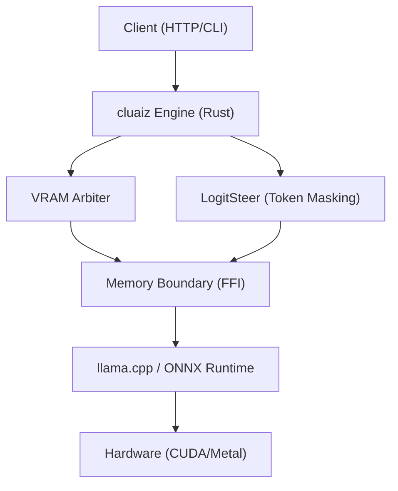

<p align="center">
  <picture>
    <source media="" srcset="assets/Banner.png">
    
  </picture>
</p>
<h3 align="center">
Power your local AI and execute native inference with bare-metal hardware and LLM control using modular extensions plugins MCP skills and CEL language modifications</h3>

</br>
<p align="center">
  
  
  
  
   <br>
  
  
  
  
</p>

## About Cluaiz

<h4>Cluaiz is a fast, easy-to-use, unified native runtime engine and orchestrator built in Rust. Optimized for edge devices, it powers local AI and agentic workflows with native CEL, WASM, and modular plugin support.</h4>

Cluaiz is a high-throughput, Rust-based inference orchestrator and runtime engine meticulously engineered to synchronize text, vision, and tool execution into a single unified memory space. This architecture is not bound to specific hardware configurations or constrained environments; it is designed as a highly elastic architecture to operate seamlessly across any tier of compute hardware—from consumer silicon to enterprise server clusters. Its primary objective is to establish a direct, transparent, and highly optimized bridge between mathematical inference kernels and autonomous agentic workflows, granting developers absolute programmatic control and optimized execution.

**The Hybrid Access and Connectivity Model**
Rather than restricting developers to a single protocol, Cluaiz introduces a comprehensive hybrid access paradigm designed to adapt to any architectural requirement. If a decoupled web application requires standard network requests, the engine's built-in HTTP REST API gateway provides a robust solution. Conversely, for architectures demanding absolute minimum latency and direct control, developers can utilize the Cluaiz Expression Language (CEL) and WebAssembly (WASM). This allows logic written in C, Python, or Rust to be compiled and executed directly within the runtime space, bypassing HTTP and JSON serialization overhead entirely. Furthermore, for those building purely native applications, Cluaiz exposes a direct C-Pointer interface, granting instantaneous access to the Foreign Function Interface (FFI) boundary within the exact same memory space.

**Dual-Engine Orchestration and Multimodal Integration**
Cluaiz is not a superficial wrapper; it natively orchestrates the execution of underlying mathematical kernels. It leverages the core logic of `llama.cpp` to ensure highly efficient parsing of GGUF models and broad cross-platform hardware portability. Simultaneously, the `ONNX Runtime` is deeply integrated to execute multimodal operations—such as vision, embeddings, and audio—in parallel. By synchronizing these engines, Cluaiz enables hybrid CPU and GPU split-loading, allowing dynamic context switching between text and vision operations without losing the underlying latent states.

**Compile-Time 1-Bit BitNet Injection & Cross-Platform Execution**
Cluaiz optimizes the execution of 1-bit and 1.58-bit (Ternary) quantization models through dynamic compile-time interception. By leveraging the cross-platform hardware portability of `llama.cpp`, the engine ensures that BitNet models can run natively on any hardware tier (CPU or GPU). During the build process, Cluaiz dynamically patches the underlying C++ inference libraries, hijacking the tensor math operations before they compile. Through injected low-level hardware instructions, the engine forces both CPUs and GPUs to process the model using actual 1-bit calculations natively. By executing pure addition and subtraction directly on hardware registers, Cluaiz achieves true 1-bit primitive throughput and entirely avoids floating-point conversions across all devices.

**Hardware Control, JIT Injection, and Memory Safety**
The engine provides complete, transparent control over system operations. It features a unique Just-In-Time (JIT) tool injection capability, allowing token generation to be paused mid-stream so that custom skills or runtime plugins can be injected via CEL under strict Rust safe memory isolation and atomic state swapping. Generation can then be instantly resumed without requiring a re-prompt or context recalculation. Parallel to this, the VRAM Arbiter continuously monitors the hardware matrix. By mathematically evaluating available physical memory before every single token generation step, the arbiter actively prevents Out-of-Memory (OOM) segment faults across any hardware scale.

**System Booster & Deep Optimization Controls**
Cluaiz features a dedicated System Booster profile granting developers surgical control over the lowest-level compilation limits and runtime behaviors. It dictates memory allocation boundaries, dynamic hardware-layer splits, and advanced KV-cache compression techniques (such as `kv_quant` and rolling `context_shift`) directly governed by the VRAM Arbiter. Additionally, the booster unlocks advanced execution features like dynamic Flash Attention (`dflash`), speculative decoding, and `turbo_quant` rotations, allowing users to precisely balance execution speed against memory limitations.

**Integrated Developer Hub**
To manage this vast ecosystem, Cluaiz includes a highly capable local Developer Hub operating on a secure local port. Here, developers are granted access to the complete API matrix, enabling them to live-test their WASM plugins, ternary kernel designs, and execution pipelines. This sandboxed environment provides the freedom to test, optimize, and push the engine's boundaries using HTTP, CEL, or C-Pointers simultaneously.

## 🛡️ **Project Trust & Current Status**

> [!WARNING]
> **Active Development**: This project is under active development. You may encounter bugs or breaking changes. Pre-compiled binary releases are **coming soon**.
>
> **Current Phase**: **Industrial Alpha (Research Phase)**.
> While the core orchestration architecture is stable, hardware-constrained guarantees and ternary kernels are undergoing validation.

## 🚀 **Quick Start**

Start chatting instantly. No setup required. cluaiz handles all GGUF downloads and hardware compilation natively.

### 1. Install cluaiz

**Windows (PowerShell)**

```powershell
powershell -ExecutionPolicy Bypass -Command "iwr -useb https://raw.githubusercontent.com/cluaiz/cluaiz/main/install.ps1 | iex"
```

**Linux & macOS (Shell)**

```bash
curl -fsSL https://raw.githubusercontent.com/cluaiz/cluaiz/main/install.sh | bash
```

### 2. Launch the Interactive TUI Dashboard

Run the naked `cluaiz` command to launch our full-terminal interactive control panel:

```bash
cluaiz
```

### 3. Start the Background API Server

Run the background daemon to serve models via the OpenAI-compatible REST API:

```bash
cluaiz serve
```

> [!TIP]
> **Pure Client Auto-Detection**: If you start `cluaiz serve` in the background, and then run the `cluaiz` dashboard in another terminal, the dashboard will automatically detect the running server and connect to it as a **Pure Client**. It will skip loading a duplicate engine locally, saving 100% of your VRAM!

### 4. Direct Headless Inference

Run any locally cached model by name:

```bash
cluaiz run gemma2:2b
```

Or pass a full **HuggingFace repo ID** — cluaiz will automatically download the GGUF weights and run inference:

```bash
# Syntax
$ cluaiz run <id>

# Example
$ cluaiz run Qwen/Qwen3-VL-2B-Instruct-GGUF
```

> [!NOTE]
> HuggingFace downloads are handled natively. cluaiz fetches GGUF weights directly over HTTPS and caches them under `~/.cluaiz/models/`.

### 5. Install Skills & Plugins Natively

Extend the AI's capabilities natively:

```bash
# Install a new skill by name
$ cluaiz skill install github-assistant

# Install a plugin
$ cluaiz plugin install web-scraper
```

---

## 📚 **Deep Documentation Reference**

<details>
<summary><b>Click to expand full technical documentation</b></summary>

### 1. Terminal & CLI Core

- **[Terminal Commands & CLI Reference](docs/reference/terminal-commands.md)**  
  An exhaustive, deeply technical engineering manual for all 32 native `cluaiz` commands. It documents the exact execution flow of the kernel, internal JSON state mutations (like `Permission.json` updates), and exact API route mappings for `serve`, `pull`, `booster`, and WASM skills orchestration.

### 2. Execution & Native Logic

- **[CEL (cluaiz Execution Language)](docs/cel)**  
  Dive into Cluaiz's custom native execution language. CEL allows you to bypass heavy Python SDKs by parsing raw syntax directly into an Abstract Syntax Tree (AST) that natively hooks into C-Pointers in shared memory (`payload_ptr`), allowing you to execute logic mid-inference with zero network latency.

### 3. Core Engine Architecture

- **[Dual Engine Architecture](docs/engine/dual_engine_architecture.md)**  
  Understand the heart of Cluaiz: the seamless orchestration layer. It explains how `cluaiz` acts as a unified C-level memory space bridging `llama.cpp` (for LLMs) and **ONNX Runtime** (for Vision & Embeddings), eliminating the fragmented network lag typical of multi-engine local AI setups.
- **[JIT KV-Cache Architecture](docs/engine/jit_architecture.md)**  
  Deep dive into the Just-In-Time memory compilation pipeline. Learn how Cluaiz analyzes prompt constraints, calculates exact physical memory limits natively, and injects pre-computed KV cache states (Dual-Caches) to dramatically reduce Time To First Token (TTFT).

### 4. Hardware Governance & Security

- **[System Booster & Hardware Tuning](docs/engine/booster.md)**  
  The ultimate guide to the `system_booster.json` configurations. Discover how the memory arbiter mathematically prevents Out-of-Memory (OOM) crashes before they hit physical silicon by configuring FlashAttention bounds, Turbo KV quantization (`kv8`, `kv16`), and aggressive Context Shifting sliding windows.
- **[Native Permission Schema](docs/engine/permission.md)**  
  A breakdown of the strict execution bounds. Explore how `Permission.json` acts as a bare-metal gatekeeper, controlling WASM Sandboxing strictness, active telemetry buffers, vectorization permissions, and native firewall rules to ensure absolute sovereign data security.

</details>

---

## 🌍 **The Cluaiz Ecosystem**

<details>
<summary><b>Click to explore the Cluaiz ecosystem</b></summary>

### 1. `cluaiz-app` (Official GUI)

- **[Repository: cluaiz-app](https://github.com/cluaiz/cluaiz-app)**
- **Technical Purpose:** This is the official graphical user interface. It connects as a **Pure Client** to the background `cluaiz serve` daemon.
- **Execution Flow:** By communicating with the engine over REST endpoints (`/health`, `/v1/chat/stream`), the app provides visual model management, vault inspection, and an interactive interface without duplicating the heavy inference engine in memory. This saves duplicate VRAM overhead.

### 2. `cluaiz-hub` (Global Registry & Extensions)

- **[Repository: cluaiz-hub](https://github.com/cluaiz/cluaiz-hub)**
- **Technical Purpose:** The central, automated manifest registry (`registry.json`) for the Cluaiz ecosystem. It hosts the source code and manifests for WASM Skills, Native Plugins, and Extensions. The CLI commands (e.g., `cluaiz extension install`) directly fetch manifests from this hub to securely link extensions into the engine.
- **Example Extension hosted in the Hub:**
  - **[cluaize-search](https://github.com/cluaiz/cluaiz-hub/tree/main/Extensions/cluaize-search):** A Native Dynamic Library (`cdylib`) built in pure Rust. It provides VRAM-aware web metasearch without heavy Python SDKs or Docker.
  - **Execution Flow:**
    1. The AI triggers an **Agentic Pause** natively mid-generation by emitting `<TRIGGER:extension:cluaiz-search>`.
    2. The extension concurrently hits SearXNG and DuckDuckGo using `reqwest`, parses the DOM using `scraper` (stripping JS/CSS), and dynamically compresses the text (using BM25) to fit the available VRAM envelope.
    3. The parsed knowledge is injected directly into the active C-pointer KV-Cache and generation resumes seamlessly.

</details>

---

## 🧠 **Features & Capabilities**

<details>
<summary><b>Click to expand</b></summary>

### 1. Hardware Execution & Memory Management

- **VRAM Arbiter (Mathematical OOM Prevention):** Automatically probes physical hardware and enforces a strict 7.5% memory safety margin. It ensures the system never crashes due to Out-of-Memory (OOM) errors, from 2GB CPUs to 80GB GPUs.
- **System Booster Tuning:** Through `system_booster.json`, gain deep hardware control over Speculative Decoding (2-4x TPS boost), Flash Attention & dflash, and Context Shifting & KV Quantization (kv16/kv8/kv4).
- **Dual-Engine Orchestration:** Unifies `llama.cpp` (Reasoning) and `ONNX Runtime` (Vision/Embeddings) into a single shared memory space, eliminating PCIe spill transfer bottlenecks.
- **BitNet & 1.58-bit Ternary Injection:** Dynamically injects `bfe.u32` and PTX instructions at compile time, enabling 4B models to hit extreme speeds on consumer GPUs.

### 2. Agentic Orchestration

- **WASM Skills & Sandboxing:** Secure WebAssembly binaries executing in a strict 64KB isolated ring, giving agents native system capabilities without REST API latency. Code executes in a strict WASM sandbox, isolated from the host.
- **Secure MCP & Native Plugin Execution (.dlso):** Manifest-driven execution. Model outputs a CEL command, and the engine directly invokes the native plugin's FFI boundary—no localhost network calls required.
- **JIT KV-Cache Injection & Hybrid Caching:** When a tool returns massive data, Cluaiz filters it natively in memory and injects only the final result directly into the attention matrix (KV Cache). Future invocations perform native `M-RoPE` injection via `.kvcache.bin`.
- **Agentic Pause:** If a skill exceeds your VRAM, cluaiz safely offloads calculation to the CPU to prevent OOM errors.
- **Hot-Reload Settings Controller:** Dynamically update YAML manifests (API keys, permissions, model settings) without restarting the engine.

### 3. Cluaiz Expression Language (CEL) Router

- **The Direct CEL API (No SDK Required):** Send raw CEL scripts (`use plugin::filesystem -> read()`) directly via HTTP. The engine parses it into an AST mapped to native C-Pointers in shared memory (`payload_ptr`), allowing native operations mid-inference.
- **Semantic Routing & Control Flow:** Internal vector routers check if an installed skill matches the intent. Chain logic (`->`) and execute loops (`foreach`) or conditionals (`if / else`) at native CPU speeds.
- **Hardware Vector Search:** Run cosine similarity scans natively utilizing SIMD / GPU tensor cores.
- **Logit-Level JSON Enforcement (LogitSteer):** Force the model to output strictly correct syntax or JSON by applying Logit-level masking during generation.
- **Mid-Generation Pivot (Hot-Steering):** Interrupt long generations with **`Ctrl+C`**. Instead of killing the process, cluaiz **Pauses** the engine. Enter a midway instruction (e.g., "Make it shorter"), and the engine processes this pivot seamlessly.

### 4. API, Ecosystem & Security

- **Unified API Gateway:** A remote execution Axum + Tokio REST/SSE gateway, fully compatible with OpenAI (`/v1/chat/completions`).
- **Native RAG Ingestion (`cluaiz ingest`):** Natively parse, semantically chunk, and save local documents (PDF, TXT, MD) into an LMDB vector storage via ONNX embeddings.
- **Automated Silicon Benchmarking (`cluaiz benchmark`):** Real-time RDTSC clocking, SIMD profiling, and exact TPS/Wattage reports.
- **Smart Model Management:** Securely pull, run, and manage GGUF weights directly into the local vault (`~/.cluaiz/models/`).
- **100% Air-Gapped Security Engine:** Governed by `Permission.json` to control telemetry, firewall, and system isolation.

</details>

---

## 🧭 **Architecture & Under the Hood**

<details>
<summary><b>Click to expand</b></summary>

### Technical Specification

- **Purpose:** A decoupled, three-tier orchestration layer to manage memory, inference state, and API requests across disparate inference backends (`llama.cpp`, `ONNX`).

- **Platform Support:** Windows (MSVC), Linux (GNU/Musl), macOS (Mach-O)
- **Reusability Level:** Global Orchestrator Gateway

### Architectural Flow



### Deep File Breakdown

- `cmd/src/main.rs`:
  - **Logic:** CLI Gateway and Argument Router.
  - **Flow:** Evaluates user commands and routes to the appropriate core logic (API server, dashboard, or headless inference).
  - **Why:** To maintain a strict separation between the CLI user interface and the background Rust kernel.

- `inference-engine/engines/cluaiz-shared/src/hardware/system_booster.rs`:
  - **Logic:** Manages the `system_booster.json` state.
  - **Flow:** Implements the VRAM Arbiter, dynamically allocating and reserving KV Cache limits based on actual physical silicon capacity. Allows toggling `mode_run` (UltraMaxBoost vs Balance), `force_vram_reclaim`, and `think_mode` natively.
  - **Why:** To mathematically prevent Out-of-Memory (OOM) failures before they hit the hardware layer and provide native context-shifting control.

### Failure & Recovery Logic

- **Potential Failure Point:** `llama.cpp` FFI pointer segfaults due to invalid VRAM calculations.

- **Recovery Logic:** The Engine probes physical silicon and applies a mandatory `7.5% Safe VRAM Allocation Margin` prior to execution. If VRAM is exhausted, the Engine triggers an Agentic Pause and falls back to CPU computation.

</details>

---

## 📊 **Hardware, Benchmarks & Troubleshooting**

<details>
<summary><b>Click to expand</b></summary>

### Hardware Compatibility Matrix

| Backend      | Vendor    | Acceleration         | Status         |
| :----------- | :-------- | :------------------- | :------------- |
| **CUDA**     | NVIDIA    | Tensor Cores (v11+)  | ✅ Alpha        |
| **Metal**    | Apple     | MPS / Neural Engine  | ✅ Alpha        |
| **Vulkan**   | Cross-Platform | Cross-Vendor Compute | ✅ Alpha        |
| **ROCm/HIP** | AMD       | Matrix Cores         | ✅ Alpha        |
| **OpenVINO** | Intel     | NPU / iGPU           | 🧪 Experimental |
| **SYCL**     | Intel     | oneAPI / XMX         | 🧪 Experimental |
| **CANN**     | Huawei    | Ascend NPU           | 🧪 Experimental |

### Local Hardware Benchmark

*Empirical data measured on an **RTX 3050 (Laptop)** running Cluaiz Alpha:*

| **Metric**         | **Bonsai1 8B** | **Gemma 4B**  | **Gemma 2B**  | **Qwen 4B**   | **Qwen 2B**   |
| :----------------- | :------------- | :------------ | :------------ | :------------ | :------------ |
| **Speed (TPS)**    | 48.6           | 19.4          | 31.6          | 21.2          | 32.7          |
| **TTFT (s)**       | 0.05s          | 0.08s         | 0.06s         | 0.08s         | 0.05s         |
| **Total Time (s)** | ~39.3s         | ~53.5s        | ~46.4s        | ~90.2s        | ~62.6s        |
| **Tokens Out**     | 1911           | 1038          | 1465          | 1913          | 2048          |
| **Memory (VRAM)**  | 2.82 GB        | ~2.5 GB       | 1.90 GB       | ~2.6 GB       | ~1.8 GB       |
| **Power Used**     | ~52W           | ~45W          | ~31W          | ~45W          | ~35W          |

> **Note**: For exhaustive automated reports across all supported architectures, see `test/benchmark/`.
>
### Hardware & Performance Troubleshooting

cluaiz pushes hardware to its absolute mathematical limits. If you experience unexpected performance drops:

1. **Laptop Power-Saving Throttling:**
   - **Observation:** If your battery drops and is unplugged, Windows forces the GPU into Battery Saver (~10W), dropping TPS to ~15.
   - **Fix:** Plug in your laptop charger. The GPU scales to ~30W+, restoring 30+ TPS.

2. **The "PCIe Spill" Phenomenon:**
   - **Observation:** Allocating too much VRAM forces the system to spill data to Shared GPU Memory (System RAM).
   - **Fix:** cluaiz applies a strict 7.5% margin. Do not override this in `system_booster.json` unless you are prepared for massive PCIe latency.

</details>

---

## 🛡️ **Security & Licensing**

<details>
<summary><b>Click to expand</b></summary>

### Security Architecture

- **Process Isolation**: Kernels execute in restricted sub-processes with strict process-level sandboxing.

- **DNA Verification**: SHA-256 manifest verification for all binary plugins and kernels before dynamic linkage.

### Note on Windows SmartScreen Warning

Since the pre-compiled `cluaiz` executables are built dynamically and are not signed with a commercial certificate, Windows Defender may show a "Windows protected your PC" pop-up.

- **Quick Bypass:** Click "More info", then click "Run anyway".

### License

cluaiz is released under the **Apache License 2.0**. See the [LICENSE](LICENSE) file for more details.

</details>
