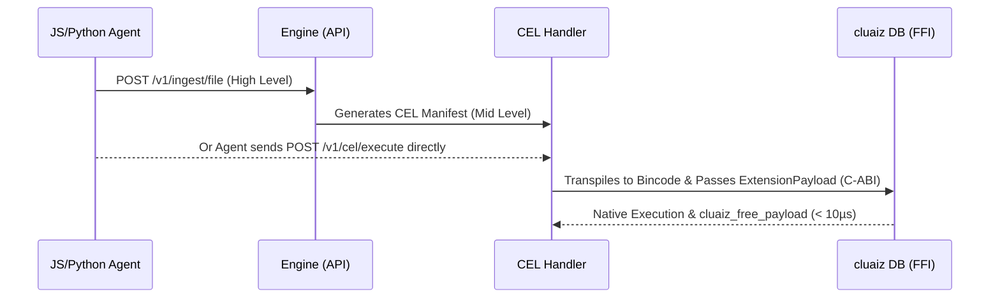

# Explanation: API vs CEL vs FFI (The Execution Triad)

## Technical Specification
- **Quadrant:** Explanation (Diátaxis Framework)
- **Purpose:** To explain the architectural difference between calling an endpoint, generating a CEL script, and executing over FFI when performing a database operation (e.g., Vector Ingestion). Includes Python and JavaScript integration patterns.
- **Core Concept:** The Engine is a "Dumb Router". All complex logic is deferred to extensions via CEL, which is ultimately executed at zero-latency over FFI.

---

## 1. The Execution Triad (Visual Flow)



---

## 2. Level 1: API (High-Level / For Normal Users)
Normal users do not need to understand CEL or FFI. They interact with standard REST endpoints.

**User Request:**
```json
// POST /v1/ingest/file
{
    "file_path": "/path/to/image.png",
    "save_location": "my_private_docs"
}
```
**Engine Responsibility:**
The Engine handles the file I/O, utilizes its `embedding_dispatcher` to generate vectors, and then **automatically writes a CEL script** on behalf of the user to persist the data.

---

## 3. Level 2: CEL (Mid-Level / For Agents & Power Users)
AI Agents or Power Users bypass the specific API endpoints and speak directly to the Engine using the **cluaiz Execution Language (CEL)** via `/v1/cel/execute`. This provides infinite flexibility without needing hardcoded endpoints in the Engine.

**CEL Script (JSON Manifest):**
```json
{
    "manifest": {
        "version": "1.0",
        "target": "extension::cluaiz-db",
        "action": "insert_vector",
        "payload": {
            "collection": "my_private_docs",
            "vector_data": [0.1, 0.8, 0.4],
            "metadata": { "file": "image.png" }
        }
    }
}
```
**Engine Responsibility:**
The Engine reads the `target`, realizes it is destined for an external extension, and immediately routes it to the FFI layer. The Engine does not process the payload.

---

## 4. Level 3: FFI (Low-Level / Zero-Latency Execution)
This is where the CEL script is executed natively. To avoid the overhead of HTTP/gRPC and JSON parsing, cluaiz uses a strict C-ABI (FFI) bridge paired with a **Bincode Transpiler**.

**Under the Hood (Rust FFI Call):**
```rust
// 1. The Engine transpiles the CEL AST into a strict binary format (Bincode)
let binary_plan = Transpiler::to_binary_payload(ast)?;

// 2. Wraps it in a C-ABI struct
let payload = ExtensionPayload::new(PayloadType::Bincode, &binary_plan);

// 3. Direct DLL invocation via libloading (Zero TCP/HTTP/JSON overhead)
unsafe {
    let result_ptr = cluaiz_db_extension::execute_cel(&payload);
    // 4. Must free the pointer using the plugin's own allocator to prevent RAM leaks
    cluaiz_db_extension::cluaiz_free_payload(result_ptr, len);
}
```
**Extension Responsibility:**
The native `cluaiz-db` extension (compiled as `.dll` or `.so`) receives the binary payload, decodes the struct natively, applies a memory-map lock (LMDB), and writes the vector in less than 10 microseconds.

---

## 5. Client SDK Integration (Python & JavaScript)

Because CEL is a universal JSON-based payload, external agents written in any language do not need massive SDKs with hundreds of functions. They only need to know how to hit one single endpoint: `/v1/cel/execute`.

### Python Integration (AI Agent Workflow)
A Python AI Agent can dynamically construct a CEL script to manage its own long-term memory in the database.

```python
import requests

# Agent dynamically builds a CEL manifest to store memory
cel_manifest = {
    "manifest": {
        "version": "1.0",
        "target": "extension::cluaiz-db",
        "action": "insert_vector",
        "payload": {
            "collection": "agent_long_term_memory",
            "vector_data": [0.12, 0.99, 0.45],
            "metadata": { "context": "User prefers dark mode." }
        }
    }
}

response = requests.post(
    "http://localhost:8000/v1/cel/execute", 
    json=cel_manifest
)
print("Memory saved via zero-latency FFI bypass:", response.json())
```

### JavaScript / TypeScript Integration (Web App Workflow)
A frontend application can directly query the vector database for RAG (Retrieval-Augmented Generation) by sending a CEL script, completely bypassing any hardcoded router logic in the engine.

```typescript
// Web app queries the vector DB directly using CEL
const celManifest = {
    manifest: {
        version: "1.0",
        target: "extension::cluaiz-db",
        action: "vector_search",
        payload: {
            collection: "agent_long_term_memory",
            query_vector: [0.12, 0.98, 0.44],
            top_k: 5
        }
    }
};

const response = await fetch("http://localhost:8000/v1/cel/execute", {
    method: "POST",
    headers: { "Content-Type": "application/json" },
    body: JSON.stringify(celManifest)
});

const results = await response.json();
console.log("Nearest semantic matches returned from FFI:", results);
```

### The SDK Philosophy
By forcing all interactions through CEL, **the cluaiz Engine never needs to be updated** when a new database feature is added. If `cluaiz-db` adds a new action like `delete_collection`, the Python and JS clients simply change the `"action": "delete_collection"` in their JSON payload. The Engine router remains completely unaware and just passes the FFI pointer.
