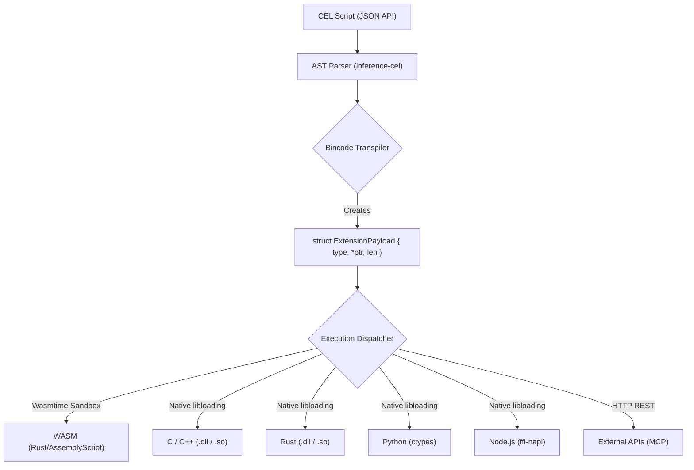

# CEL Native Engine Bindings (Execution Deep Dive)

## 1. TECHNICAL SPECIFICATION

- **Quadrant:** Explanation (Diátaxis Framework)
- **Purpose:** To visualize and explain exactly how the cluaiz Engine bridges CEL AST structures to hardware execution via WASM and Native FFI endpoints across multiple languages.
- **Audience:** Core Engine Developers, Security Auditors, High-Performance Extension Authors.

---

## 2. EXECUTOR ROUTING ARCHITECTURE (`Cluaizxecutor`)

Before data crosses the C-ABI boundary to external plugins, the `cel://local/executor` endpoint routes scripts to the correct sandbox tier using the `Cluaizxecutor` enum (`inference-cel/src/execution/mod.rs`).

```mermaid
flowchart TD
    A["cel://local/executor"] --> B{"Cluaizxecutor Router"}
    
    B -->|Fast Path (0ms)| C["Native (CEL AST)"]
    B -->|Heavy Compute| D["Wasmtime Sandbox"]
    B -->|Legacy Scripts| E["Rhai Interpreter"]
    
    C --> F["Host OS / Native Rust"]
    
    D -->|ResourceLimiter & set_fuel()| G["WASM Memory Space"]
    G -->|ExtensionPayload C-ABI| H["Plugin Export (.wasm)"]
    
    E --> I["AST Walk (Engine Main Thread)"]
    I -->|Scope Injection| J["legacy_script()"]
```

- **Native (`NativeExecutor`)**: Parses raw strings into `CelAst` and executes them natively in the `tokio` thread pool with zero FFI boundary crossings.
- **Wasm (`WasmExecutor`)**: For external plugins. Routes to `wasmtime` JIT with strict `set_fuel()` (instruction limits) and `ResourceLimiter` (memory limits) constraints.
- **Rhai (`LegacyRhaiExecutor`)**: Mounts `.rhai` scripts directly into the Engine thread and injects scope variables artificially.

---

## 3. THE UNIVERSAL C-ABI BOUNDARY

The cluaiz Engine acts as a dumb router. When it parses a CEL statement, it transpiles the AST into a raw binary `ExtensionPayload` struct using **Bincode**. This struct is strictly designed under the C Application Binary Interface (`#[repr(C)]`), which guarantees that pointers align correctly across the memory boundary of completely different programming languages.



---

## 4. WASM SANDBOX BINDINGS (Rust / C / WebAssembly)

Community extensions must be compiled to `.wasm` to prevent OS-level system access.

**Execution Flow:**

1. **Compilation & Cache:** The Engine loads the WASM module into `wasmtime` and saves the compiled state in `WASM_CACHE` (DashMap) for zero-latency reuse.
2. **Resource Limits (Security):** The `EngineRules` manifest dictates limits:
   - `store.set_fuel()` strictly counts and limits CPU instructions (prevents infinite loops).
   - `wasmtime::ResourceLimiter` denies memory allocation if it exceeds `max_memory_mb`.
3. **Execution Execution (`wasm_sandbox.rs`):**
   - The Engine calls the `allocate` function inside WASM to reserve RAM.
   - The Engine copies the `ExtensionPayload` into WASM linear memory.
   - The Engine calls `execute_cel(ptr, len)`.
   - The WASM plugin returns a packed 64-bit integer `(ret_ptr, ret_len)`.
   - The Engine reads the result and immediately calls `deallocate` inside WASM to prevent sandbox memory leaks.

---

## 5. NATIVE DYNLIB BINDINGS (C/C++ / Rust)

Core engine components (like `cluaiz-db` or CUDA drivers) use native Dynamic Libraries (`.dll`, `.so`, `.dylib`) for bare-metal hardware access without WASM overhead.

**Execution Flow:**

1. **Security Checks (`native_sandbox.rs`):**
   - Dynamically blocked on Mobile OS (iOS/Android).
   - Engine calls `std::fs::canonicalize` on the DLL path to prevent Path Traversal exploits (`../../hack.dll`).
2. **libloading:** The DLL is dynamically linked. The Engine searches for the exact C-ABI symbol: `execute_cel(*const ExtensionPayload)`.
3. **Memory Ownership:** Because the DLL allocates memory using the system allocator, the Engine CANNOT free it. The Engine extracts the result, and then calls the DLL's exported `cluaiz_free_payload` function. If missing, the Engine flags a RAM leak warning.

---

## 6. DYNAMIC LANGUAGE BINDINGS (Python / Node.js)

The exact same `ExtensionPayload` C-ABI pointer can be passed directly to scripting languages without TCP/HTTP overhead, bridging the engine directly to heavy ML environments.

### Python (`ctypes`)

Python extensions bind directly to the cluaiz Engine memory using the `ctypes` library.

```python
import ctypes

class ExtensionPayload(ctypes.Structure):
    _fields_ = [
        ("payload_type", ctypes.c_int),
        ("data_ptr", ctypes.POINTER(ctypes.c_uint8)),
        ("data_len", ctypes.c_size_t),
    ]

# The engine calls this Python C-export via FFI
@ctypes.CFUNCTYPE(ctypes.c_void_p, ctypes.POINTER(ExtensionPayload))
def execute_cel(payload_ptr):
    payload = payload_ptr.contents
    print(f"Received {payload.data_len} bytes from Engine natively!")
    return ctypes.c_void_p(0)
```

### Node.js / JS V8 (`ffi-napi`)

Similar to Python, JavaScript (via Node.js) can read the native Engine memory directly using `ffi-napi`.

```javascript
const ffi = require('ffi-napi');
const ref = require('ref-napi');

const ExtensionPayload = require('ref-struct-di')(ref)({
  payload_type: ref.types.int,
  data_ptr: ref.refType(ref.types.uint8),
  data_len: ref.types.size_t
});

// Registering the C-ABI listener for the cluaiz Engine
const lib = ffi.Library('cluaiz_js_binding', {
  'execute_cel': [ 'pointer', [ ref.refType(ExtensionPayload) ] ]
});
```

---

## 7. LEGACY SCRIPTING (Rhai)

Before strict C-ABI transpilation was adopted, cluaiz used `.rhai` (Tier-4 execution). This executes slowly via an embedded AST interpreter within the Engine's main thread and is strictly retained only for backward compatibility with pre-1.0 skills.
