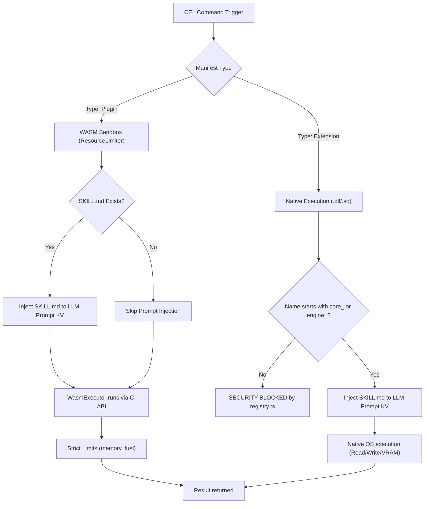

# CEL Architecture: Plugins vs. Extensions (Execution Deep Dive)

## 1. TECHNICAL SPECIFICATION
- **Quadrant:** Explanation (Diátaxis Framework)
- **Purpose:** To technically define the architectural, security, and execution boundaries separating CEL Plugins from CEL Extensions within the cluaiz Engine.
- **Audience:** Core Engine Developers, Extension Authors, Security Auditors.

---

## 2. THE FUNDAMENTAL DICHOTOMY
While both Plugins and Extensions are treated uniformly as an `Integration` within `inference-cel/src/execution/registry.rs`, their execution routing, security clearances, and interaction with the LLM's KV Cache diverge completely at runtime.

### The Architectural Split & Scope
1. **Plugin (Single-Function Muscle):** A small, isolated, single-purpose tool (e.g., a math calculator, weather checker). It consists of a single binary (`.wasm`, `.dll`, or `.so`). It can **optionally** have a `SKILL.md` to teach the AI how to use it, but runs strictly isolated.
2. **Extension (Complete Subsystem):** A massive, deeply integrated ecosystem (e.g., Database Engine, Search Engine). It is the "Ultimate Union" that bundles **multiple plugins** or large application wrappers together under a single mandatory `SKILL.md` brain. It has access to raw Native OS power and direct VRAM manipulation.

---

## 3. ARCHITECTURE & EXECUTION FLOW



---

## 4. DEEP CODE-LEVEL DIFFERENCES

### A. Execution Sandbox (`registry.rs`)
The engine determines the execution environment based on `sandbox_type` declared in the manifest, NOT the file extension.

- **Plugin (`sandbox_type: "WASM"`):** Bound to `Cluaizxecutor::Wasm`. The engine utilizes `wasmtime` with strict fuel limits (CPU cycles) and `ResourceLimiter` (RAM caps). It operates entirely isolated from the host OS.
- **Extension (`sandbox_type: "NATIVE"`):** Bound to `Cluaizxecutor::Native`. It utilizes `libloading` for bare-metal C-FFI performance. 
  - **Security Gate:** Hardcoded in `registry.rs`, any manifest declaring `NATIVE` must have a name prefixed with `core_` or `engine_`. Community extensions attempting to request `NATIVE` will be immediately rejected to prevent arbitrary OS access.

### B. LLM Context Injection (`chat.rs`)
The engine's API handler (`chat.rs`) **does not** hardcode different logic for Plugins vs Extensions when it comes to memory injection.

- **Universal Injection:** The code simply checks `if let Ok(skill_content) = std::fs::read_to_string(&skill_path)`. If **any** component (Plugin or Extension) contains a `SKILL.md`, `chat.rs` will read it and trigger a thread block:
  ```rust
  // Internal engine pause for cognitive injection
  current_prompt = format!(
      "{}{}\n\n[SYSTEM INJECTION: TOOL SCHEMA FOR {}]\n{}\n[SYSTEM: RESUME GENERATION]\n", 
      current_prompt, total_generated, comp_name, injection
  );
  ```
  This forces an "Agentic Pause" where the engine recompiles the KV Cache to make the LLM aware of the exact grammar (`cel_grammar`) required to use the extension.

### C. Structural Composition & Bundling
- **Plugin:** Maps to a single functional execution file (`wasm/so/dll`). It is a single atomic unit of work (e.g., one specific function).
- **Extension:** Acts as an orchestration layer. An extension can literally bundle and trigger **multiple plugins** internally to form a complete software subsystem.

### D. VRAM & Persistent State (`vram_kv_inject`)
- **Plugin:** `vram_kv_inject` is explicitly `false`. Plugins return finite byte streams over the C-ABI.
- **Extension:** Capable of declaring `vram_kv_inject: true`. When `registry.rs` loads an extension with a `.bin` asset, it triggers `inject_from_cpu(&state_bytes, "global_kv_cache")`, directly mounting data (like database indexes) into the GPU VRAM for zero-latency retrieval.

---

## 5. DECISION MATRIX: WHEN TO USE WHICH

| Feature Requirement | Use Plugin | Use Extension |
| :--- | :---: | :---: |
| Single, small, specific function (Math, Weather)? | ✅ | ❌ |
| Bundles multiple tools into a large application? | ❌ | ✅ |
| Can use `SKILL.md` to teach AI? | ✅ (Optional) | ✅ (Mandatory) |
| Access to Host File System or Network? | ❌ | ✅ |
| Sandboxed Execution (Untrusted Code)? | ✅ | ❌ |
| Core Engine Feature (`core_`/`engine_`)? | ❌ | ✅ |

**Rule of Thumb:** If you are building a small, single-purpose tool (like a calculator), build a **Plugin**. If you are building a massive application (like a Search Engine) that requires bundling multiple functionalities, raw OS access, and VRAM mapping, build an **Extension**.

---

## 6. DEEP FAQ

**Q: Can a Plugin write to disk if I set `file_system: "read_write"` in `manifest-plugin.yaml`?**
No. Even if declared in the manifest, the `WasmExecutor` strictly denies host-OS file descriptors. The WASM sandbox operates completely headless.

**Q: Why does the engine reject my Extension load with a `SECURITY BLOCKED` error?**
According to `registry.rs`, any manifest requesting `sandbox_type: "NATIVE"` must have a `name` starting with `core_` or `engine_`. If your extension is named `custom_db`, it will be blocked from native execution to prevent malicious OS-level memory access.

**Q: What is the performance penalty of Context Injection?**
If a Plugin or Extension has a `SKILL.md`, `chat.rs` must trigger an `agentic_pause_compile_cache()` event to rebuild the LLM context. This adds overhead. A "headless" Plugin without a `SKILL.md` skips this pause, resulting in zero KV cache overhead, making it ideal for rapid, blind computations.

**Q: How do Extensions inject data into VRAM directly?**
If an extension manifest includes a `.bin` file reference, `registry.rs` bypasses the execution loop entirely at load-time and pushes the raw bytes directly to the `global_kv_cache` via `inject_from_cpu()`.
