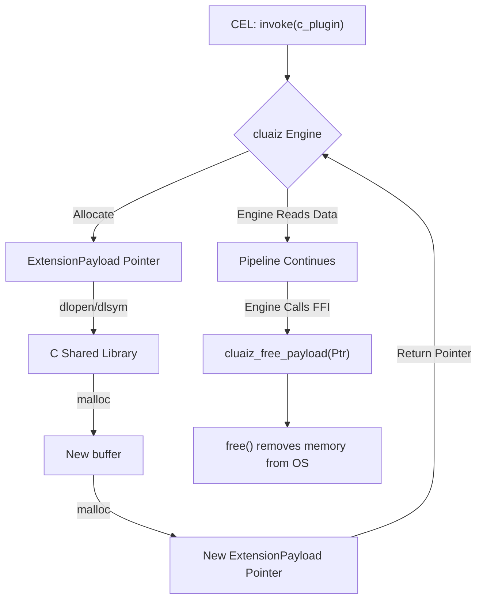

# CEL C SDK

Because the cluaiz Engine communicates across the boundary using a strict C-ABI, writing a cluaiz plugin in pure C is the most direct and zero-overhead method available.

## The Memory Struct

The core struct is defined natively in C.

```c
#include <stdint.h>
#include <stdlib.h>
#include <string.h>

typedef enum {
    Json = 0,
    Cdql = 1,
    WasmBinary = 2,
    RawBytes = 3,
    Bincode = 4
} PayloadType;

typedef struct {
    PayloadType payload_type;
    const uint8_t* data_ptr;
    size_t data_len;
} ExtensionPayload;
```

## Creating a C SDK Plugin

When you compile your C code to a shared library (`.so`, `.dll`), the Engine loads the function pointer dynamically.

### 1. The Execution Function

```c
#if defined(_WIN32)
#define EXPORT __declspec(dllexport)
#else
#define EXPORT __attribute__((visibility("default")))
#endif

EXPORT ExtensionPayload* process_data(const ExtensionPayload* input) {
    if (!input) return NULL;
    
    // Example: Read input bytes
    // Note: Do not free `input`. The Engine owns it.
    
    // Allocate outgoing payload
    ExtensionPayload* out_payload = (ExtensionPayload*)malloc(sizeof(ExtensionPayload));
    
    const char* response = "{\"status\": \"processed_by_c\"}";
    size_t len = strlen(response);
    
    // Allocate buffer for data
    uint8_t* buffer = (uint8_t*)malloc(len);
    memcpy(buffer, response, len);
    
    out_payload->payload_type = Json;
    out_payload->data_ptr = buffer;
    out_payload->data_len = len;
    
    return out_payload;
}
```

## Memory Management

In C, memory management is explicit. Because you used `malloc`, you are responsible for freeing it. The Engine will call `cluaiz_free_payload` when it finishes reading the pointer.

### 2. The Free Function

```c
EXPORT void cluaiz_free_payload(ExtensionPayload* ptr) {
    if (!ptr) return;
    
    if (ptr->data_ptr) {
        free((void*)ptr->data_ptr);
    }
    
    free(ptr);
}
```

## Architectural Flow


