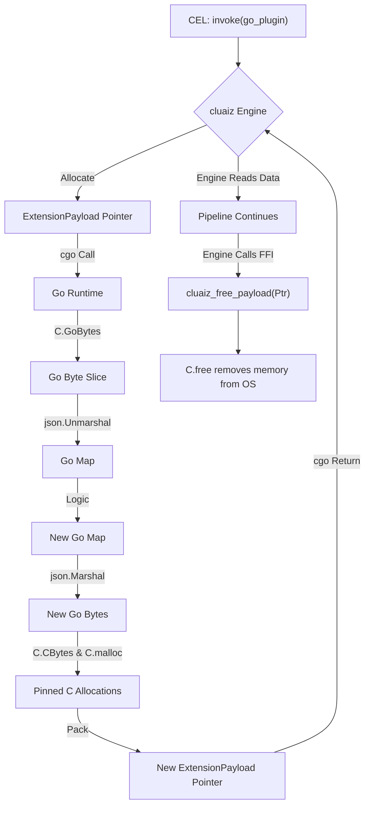

# CEL Go SDK

Go (Golang) is highly performant and widely used for backend microservices. To interact with the cluaiz Engine natively without HTTP overhead, you can use **cgo** to interface directly with the `ExtensionPayload` C-ABI struct.

## The Memory Struct

The cluaiz Engine passes data to your Go plugin using this struct:

```c
typedef enum {
    Json = 0,
    Cdql = 1,
    WasmBinary = 2,
    RawBytes = 3,
    Bincode = 4
} PayloadType;

typedef struct {
    PayloadType payload_type;
    const uint8_t* data_ptr;
    size_t data_len;
} ExtensionPayload;
```

## Creating a Go SDK Plugin

Using `cgo`, you can export Go functions to be called by the Rust Engine.

### 1. The Execution Function

```go
package main

/*
#include <stdint.h>
#include <stdlib.h>

typedef enum { Json = 0, Cdql = 1, WasmBinary = 2, RawBytes = 3, Bincode = 4 } PayloadType;

typedef struct {
    PayloadType payload_type;
    const uint8_t* data_ptr;
    size_t data_len;
} ExtensionPayload;
*/
import "C"
import (
	"encoding/json"
	"unsafe"
)

//export process_data
func process_data(input *C.ExtensionPayload) *C.ExtensionPayload {
	// 1. Read the input pointer
	dataLen := int(input.data_len)
	dataSlice := C.GoBytes(unsafe.Pointer(input.data_ptr), C.int(dataLen))

	// Example: Parsing JSON
	var payload map[string]interface{}
	if input.payload_type == C.Json {
		json.Unmarshal(dataSlice, &payload)
	}

	// 2. Perform Logic
	payload["status"] = "processed_by_go"

	// 3. Serialize output
	outBytes, _ := json.Marshal(payload)
	outLen := C.size_t(len(outBytes))

	// 4. Allocate C memory (malloc)
	// We MUST allocate this using C.malloc so the C-ABI memory isn't collected by Go's GC
	cDataPtr := (*C.uint8_t)(C.CBytes(outBytes))

	outPayload := (*C.ExtensionPayload)(C.malloc(C.sizeof_ExtensionPayload))
	outPayload.payload_type = C.Json
	outPayload.data_ptr = cDataPtr
	outPayload.data_len = outLen

	return outPayload
}

func main() {}
```

## Memory Management (Preventing Leaks)

Because you used `C.malloc` and `C.CBytes`, Go's Garbage Collector will completely ignore this memory. If the Rust Engine drops the pointer without freeing it, you will leak memory. 

You **must** implement `cluaiz_free_payload`.

### 2. The Free Function

```go
//export cluaiz_free_payload
func cluaiz_free_payload(ptr *C.ExtensionPayload) {
	if ptr == nil {
		return
	}
	
	// Free the inner byte array
	if ptr.data_ptr != nil {
		C.free(unsafe.Pointer(ptr.data_ptr))
	}
	
	// Free the struct itself
	C.free(unsafe.Pointer(ptr))
}
```

## Architectural Flow


