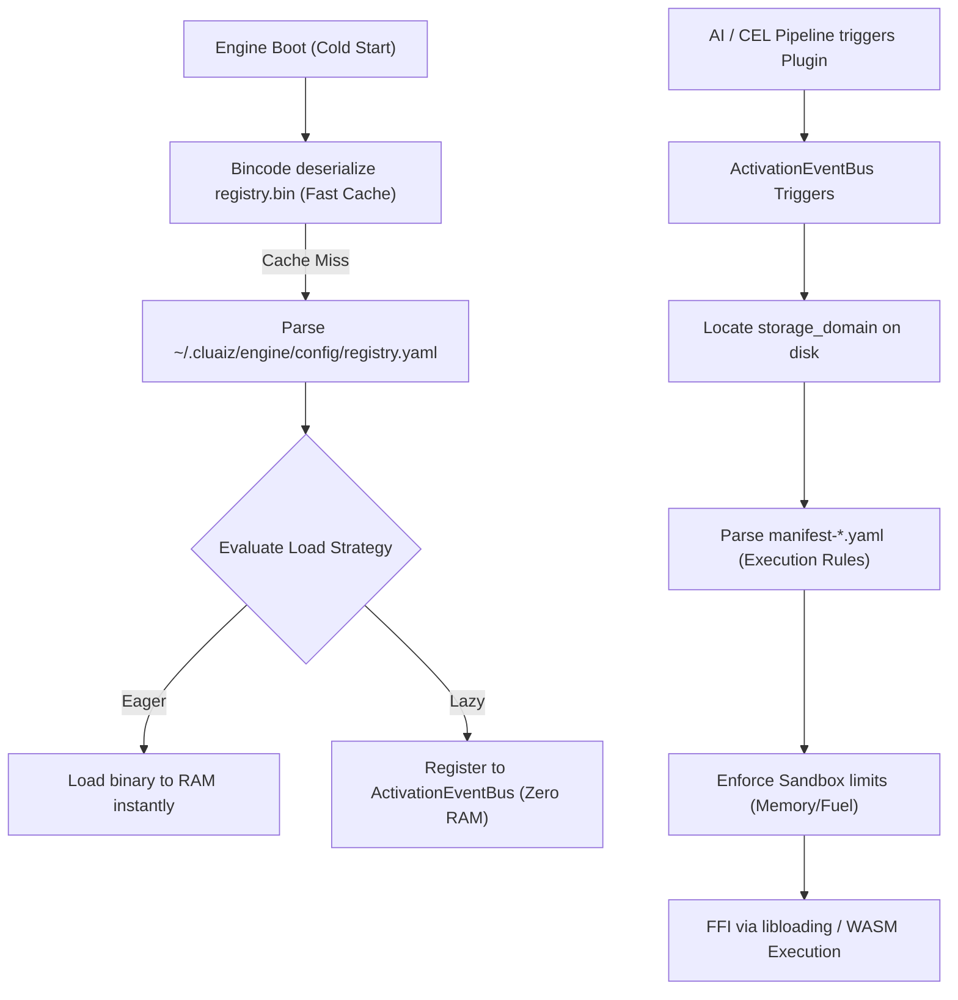

# Two-Tier Extension Architecture: Registry and Manifest

When you build a custom plugin (e.g., a `.wasm` file), you must tell the cluaiz Engine how to load and sandbox it. This is handled entirely locally on your machine via a Two-Tier Architecture: **The Registry** and **The Manifest**.

This system ensures that the Engine can index thousands of plugins without scanning your entire hard drive, allowing it to boot instantly.

---

## 1. Architectural Flow

The engine uses a strict separation of concerns between **Indexing** (`registry.yaml`) and **Execution Rules** (`manifest-plugin.yaml`, `manifest-extension.yaml`, `manifest-mcp.yaml`).

---

## 2. Tier 1: The Master Registry (`MasterRegistry`)

**Source of Truth File:** `~/.cluaiz/engine/config/registry.yaml`  
**Binary Cache:** `registry.bin`  

The Engine reads this file *once* at boot. It acts as a phonebook for all your custom plugins. When you create a new WASM plugin folder, you add an entry here so the Engine knows it exists.

### `RegistryEntry` Schema (Exhaustive)

| Keyword | Type | Description |
|---|---|---|
| `id` | `String` | Unique identifier generated at installation (e.g., `ext_custom_math_123`). |
| `domain` | `String` | Relative path where the component lives (e.g., `plugins/math`). Used to locate the component folder instantly. |
| `load_strategy` | `Enum` | `EAGER` (Load into RAM immediately), `LAZY` (Register events, load on demand), `MANUAL` (Only via CLI). |
| `activation_events`| `Vec<String>` | Event patterns that trigger lazy loading (e.g., `"on_command:use plugin::math"`). |
| `enabled` | `bool` | If false, the engine ignores the component entirely. Default is `true`. |
| `binary_hash` | `Option<String>`| SHA256 checksum to verify the binary wasn't tampered with. |
| `semantic_index` | `Option<Vec<String>>` | Keyword triggers for the AI to instantly route requests. |

---

### 3. Tier 2: The Component Manifest (`ExtensionManifest`)

**Source of Truth File:** `manifest-extension.yaml` / `manifest-plugin.yaml` / `manifest-mcp.yaml` (inside the component's folder)  
**Binary Cache:** `manifest-extension.bin` / `manifest-plugin.bin` / `manifest-mcp.bin`

This file defines *how* the component executes, its hardware limits, and its exact AI interface. 

> [!NOTE]
> For zero-latency boots, the Engine attempts to load the `.bin` cache first. If it misses, it lazily parses the `.yaml` source of truth and instantly auto-compiles it to `.bin`.

> [!TIP]
> **Complete Example:** We have created fully documented, heavily commented, real-world examples of Manifest files. You can view them here: [**`docs/cel/manifest-extension.yaml`**](file:///c:/Users/Aryan/my/Cluaiz-workspace/Cluaiz-Technologies/cluaiz/docs/cel/manifest-extension.yaml), [**`manifest-plugin.yaml`**](file:///c:/Users/Aryan/my/Cluaiz-workspace/Cluaiz-Technologies/cluaiz/docs/cel/manifest-plugin.yaml), and [**`manifest-mcp.yaml`**](file:///c:/Users/Aryan/my/Cluaiz-workspace/Cluaiz-Technologies/cluaiz/docs/cel/manifest-mcp.yaml).

### Base Metadata Fields
| Keyword | Type | Description |
|---|---|---|
| `name` | `String` | Exact name of the component. |
| `version` | `String` | Semantic version string (e.g., `1.0.0`). |
| `description` | `String` | Brief description of the component's purpose. |
| `author` | `String` | Author or publisher name. |
| `type` | `Enum` | Must be `extension`, `plugin`, or `mcp`. |

### `discovery` Block (AI Routing)
| Keyword | Type | Description |
|---|---|---|
| `semantic_triggers` | `Vec<String>` | Keywords that prompt the AI to remember and use this tool. |
| `cel_grammar` | `String` | The exact CEL syntax the AI should use to invoke it. |

### `activation` Block (Loading Strategy)
| Keyword | Type | Description |
|---|---|---|
| `lazy_load` | `bool` | True = Engine loads it into RAM only when needed. |
| `trigger_on` | `Vec<String>` | Event strings that trigger the Engine to load the component (e.g., `on_command:use plugin::math`). |

### `permissions` Block (Security & Hardware Limits)
| Keyword | Type | Description |
|---|---|---|
| `max_memory_mb`| `Option<u32>` | Hard RAM cap in MB. WASM memory allocator traps and kills if breached. |
| `max_cpu_time_ms` | `Option<u64>` | Maximum CPU execution duration in ms to prevent infinite loops. |
| `network_access` | `bool` | True/False. Allow HTTP calls from sandbox? |
| `vram_kv_inject` | `bool` | True/False. Can this component directly inject data into the AI's KV cache? |
| `file_system` | `Enum` | `none`, `read_only`, or `read_write`. |
| `allowed_hosts` | `Option<Vec<String>>` | Whitelisted domains for network access (mostly used by MCPs). |

### `execution` Block (Execution & Linking)
| Keyword | Type | Description |
|---|---|---|
| `envelope` | `Enum` | Execution sandbox type: `WASM` or `NATIVE`. (Not used for MCP). |
| `entry_point` | `String` | C-FFI entry point function name. Engine calls this (e.g., `execute_cel`). |
| `payload_format` | `Enum` | Data serialization format: `MsgPack` or `JSON`. |
| `command` | `String` | (MCP Only) The OS command to execute (e.g., `npx`, `python`). |
| `args` | `Vec<String>` | (MCP Only) Arguments passed to the command. |
| `env` | `Map<String, String>` | (MCP Only) Environment variables injected into the OS process. |

---

## 4. Crucial Implementation Notes

> [!CAUTION]
> **Serialization Case-Sensitivity:** The `envelope` field uses `#[serde(rename_all = "UPPERCASE")]`. You MUST write `NATIVE` or `WASM` in all caps in the YAML file. Using CamelCase (e.g., `NativeDll`) will cause fatal deserialization panics.

> [!WARNING]
> **Memory Leaks in NATIVE FFI:** For `NATIVE` extensions, the host's `execute()` FFI bridge strictly expects the DLL to export `cluaiz_free_payload`. If you export a generic freeing function, the host engine will fail to find the symbol and cause memory leaks. (Note: WASM plugins do not suffer from this as their linear memory is dropped automatically).
