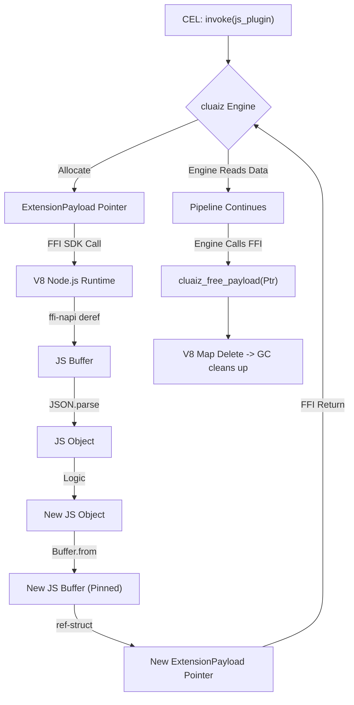

# CEL Node.js SDK

While Node.js operates inside the V8 JavaScript engine, it can interface with the cluaiz Engine directly via the **CEL SDK** using native Addons or FFI (Foreign Function Interface). This entirely bypasses the HTTP networking stack and JSON serialization cost for raw bytes.

## The Memory Struct

When the cluaiz Engine invokes a JavaScript SDK plugin, it passes a pointer to the `ExtensionPayload` C-ABI struct. You must read this using `node-ffi-napi` or a native C++ addon.

```c
// The C equivalent of cxp_ffi.rs
typedef enum {
    Json = 0,
    Cdql = 1,
    WasmBinary = 2,
    RawBytes = 3,
    Bincode = 4
} PayloadType;

typedef struct {
    PayloadType payload_type;
    const uint8_t* data_ptr;
    size_t data_len;
} ExtensionPayload;
```

## Creating a Node.js SDK Plugin

You can use the `ffi-napi` and `ref-napi` libraries in Node.js to receive the pointer, parse the data, and return a new struct.

### 1. The Execution Function

```javascript
const ffi = require('ffi-napi');
const ref = require('ref-napi');
const StructType = require('ref-struct-di')(ref);

// Define the ExtensionPayload C-Struct in JS
const ExtensionPayload = StructType({
    payload_type: ref.types.int32,
    data_ptr: ref.refType(ref.types.uint8),
    data_len: ref.types.size_t
});

const ExtensionPayloadPtr = ref.refType(ExtensionPayload);

// Export the C-ABI function
module.exports = ffi.Callback(ExtensionPayloadPtr, [ExtensionPayloadPtr], function(inputPtr) {
    // 1. Dereference the C struct
    const input = inputPtr.deref();
    
    // 2. Read the raw bytes from the buffer
    const buffer = ref.readPointer(input.data_ptr, 0, input.data_len);
    
    // Example: If PayloadType is Json (0)
    let data;
    if (input.payload_type === 0) {
        data = JSON.parse(buffer.toString('utf8'));
    }

    // 3. Perform Logic
    data.processed = true;

    // 4. Create the Outgoing Buffer
    const outString = JSON.stringify(data);
    const outBuffer = Buffer.from(outString, 'utf8');

    // 5. Construct the returned ExtensionPayload
    const outPayload = new ExtensionPayload();
    outPayload.payload_type = 0; // Json
    outPayload.data_ptr = outBuffer;
    outPayload.data_len = outBuffer.length;

    // Return the memory pointer back to the cluaiz Engine
    return outPayload.ref();
});
```

## Memory Management (Preventing Leaks)

Because V8 is a Garbage Collected language, passing a `Buffer` pointer across the SDK FFI boundary to Rust creates a massive memory leak risk. If V8's Garbage Collector cleans up the `outBuffer` before Rust finishes reading it, you get a Segfault. If V8 *never* cleans it up because it thinks C holds the reference, you get an OOM (Out of Memory).

You **must** implement `cluaiz_free_payload`.

### 2. The Free Function

To properly free memory, you should maintain a global registry of pointers you have handed off to cluaiz.

```javascript
// A registry to prevent V8 from garbage collecting buffers while Rust is reading them
const activeBuffers = new Map(); 

module.exports.cluaiz_free_payload = ffi.Callback(ref.types.void, [ExtensionPayloadPtr], function(ptr) {
    if (ptr.isNull()) return;
    
    const payload = ptr.deref();
    const address = payload.data_ptr.address();
    
    // Release the reference, allowing V8 to Garbage Collect it safely
    activeBuffers.delete(address);
});
```
*Note: In the execution function, you must do `activeBuffers.set(outBuffer.address(), outBuffer)` before returning the pointer.*

## Architectural Flow


