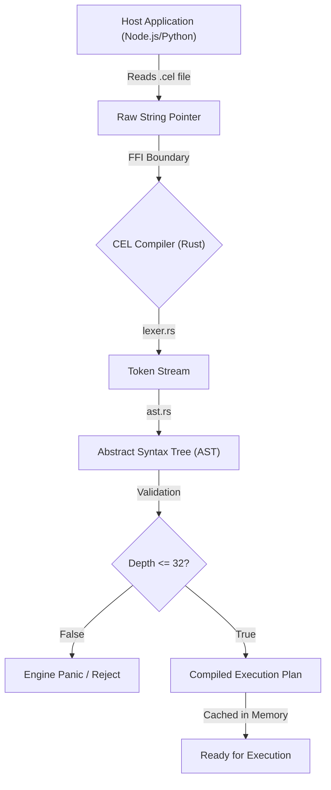

# Writing Direct CEL Code via SDK

When using the cluaiz SDK in your host language (Python, Node.js, Go, etc.), you have two options for passing CEL code:
1. Hardcoding the pure CEL string in your backend code.
2. Reading a dedicated `.cel` file into the SDK.

## The Concept: What and Why?

Before diving into code, let's understand the core concept of a `.cel` file.

### What is a `.cel` file?
A `.cel` (cluaiz Execution Language) file is a dedicated text file where you write your AI workflows and data pipelines. Instead of writing your logic inside a Python string (e.g., `script = "let $x = use plugin..."`), you write it in a separate file, just like you would write SQL in a `.sql` file or HTML in a `.html` file.

**What exactly do you write inside it?**
You write the "Data Flow". You define how data moves from one AI plugin to another. For example: "Take this user query -> give it to the Vector DB to find context -> give that context to the LLM to generate an answer."

### Why do we need it? (The "Kyu?")
If you can just write the string inside Python, why go through the trouble of creating a `.cel` file?

1. **Separation of Concerns:** Python/Node.js should only handle things like HTTP requests (e.g., FastAPI/Express) and database connections. The actual AI Brain logic (prompt chaining, vector searches, tool calls) should be isolated in `.cel` files. If the AI logic changes, you don't have to touch your backend server code.
2. **Readability & IDE Power:** If you write a 50-line AI pipeline inside a Python string, it becomes a massive block of green text. There is no auto-complete, no bracket matching, and no error checking. A `.cel` file gives you full syntax highlighting in your IDE.
3. **Pre-compilation (Speed):** This is the biggest reason. If you pass a string in Python during a user request, the Engine has to read the string, understand it, and compile it *while the user is waiting*. If you use a `.cel` file, your backend can read it once when the server starts up, pre-compile it into memory, and execute it instantly for every user request.

---

## 1. The Compilation Pipeline (Under the Hood)

When a host application passes a `.cel` string to the Rust Engine, it doesn't just execute it blindly. It goes through a strict compilation pipeline defined in `inference-cel/src/parser/lexer.rs` and `ast.rs`.

### The Three Phases
1. **Lexical Analysis (`lexer.rs`)**: The engine scans the `.cel` string and converts keywords (`use`, `let`, `invoke`) into highly optimized `Token` enums. String processing happens only once here.
2. **AST Construction (`ast.rs`)**: The tokens are arranged into an Abstract Syntax Tree (AST). The engine strictly enforces `MAX_PARSE_DEPTH = 32` during this phase to prevent stack overflows from malicious or deeply nested scripts.
3. **Execution Routing**: Once the AST is validated, the Engine maps each AST node to the `ExtensionPayload` C-ABI struct, ready to be dispatched to WASM, Rhai, or Native executors.



## 2. Zero-Latency Execution via Cold Boot

Parsing strings takes CPU cycles. If you hardcode CEL strings inside your API routes (e.g., inside an Express.js `app.post` handler), the Engine has to run the compilation pipeline *every single time* a user makes a request.

By using dedicated `.cel` files, your backend can perform a **Cold Boot Pre-compilation**.

### The Cold Boot Architecture
During startup, the host reads all `.cel` files and passes them to the cluaiz SDK. The SDK runs the compilation pipeline and stores the resulting `Execution Plan` (the compiled AST) in RAM. When a live API request hits, the host simply tells the SDK to execute the pre-compiled plan by its ID.

**Deep Dive Example: The `.cel` File & Python Host**

First, author your logic in a dedicated `.cel` file. Your IDE will provide full syntax highlighting and linting.

```cel
// rag_pipeline.cel
let $query = ?1
let $embeddings = use plugin::embedding -> invoke(embed, text: $query)

let $context = use plugin::qdrant 
    -> invoke(search, vector: $embeddings, top_k: 5)
    -> filter(score >= 0.85)
    -> select(payload.text)

use plugin::llm -> invoke(chat, prompt: "Answer using context: " + $context + ". Query: " + $query)
```

Next, write the host application that reads this file and pre-compiles it:

```python
import cluaiz_sdk
import asyncio
import aiofiles

# Global dictionary to hold pre-compiled AST IDs
COMPILED_PIPELINES = {}

async def cold_boot_initialization():
    """ Runs ONCE during backend startup """
    async with aiofiles.open('rag_pipeline.cel', mode='r') as f:
        pure_cel_script = await f.read()
        
    # The Engine parses the string, builds the AST, caches it, and returns an ID.
    # No execution happens here.
    ast_id = cluaiz_sdk.compile(pure_cel_script)
    COMPILED_PIPELINES['rag'] = ast_id

async def handle_api_request(user_query: str):
    """ Runs 1000s of times per second. ZERO parsing overhead. """
    ast_id = COMPILED_PIPELINES['rag']
    
    # Executes the pre-compiled AST instantly
    return cluaiz_sdk.execute_ast(ast_id, parameters=[user_query])
```

## 3. Developer Ergonomics and Safety

Beyond performance, authoring native `.cel` files provides essential engineering benefits:

- **IDE Tooling**: Hardcoded strings in Python/Go are opaque to your IDE. A `.cel` file triggers VS Code extensions to provide syntax highlighting, bracket matching, and auto-indentation.
- **Static Linting**: Because the logic is isolated in a file, CLI tools (`cluaiz check pipeline.cel`) can parse the AST and validate plugin endpoints *before* the backend boots.
- **Git Diffs**: Reviewing PRs (Pull Requests) with changes to `.cel` files is significantly easier than reviewing changes hidden inside massive multi-line Python strings.
