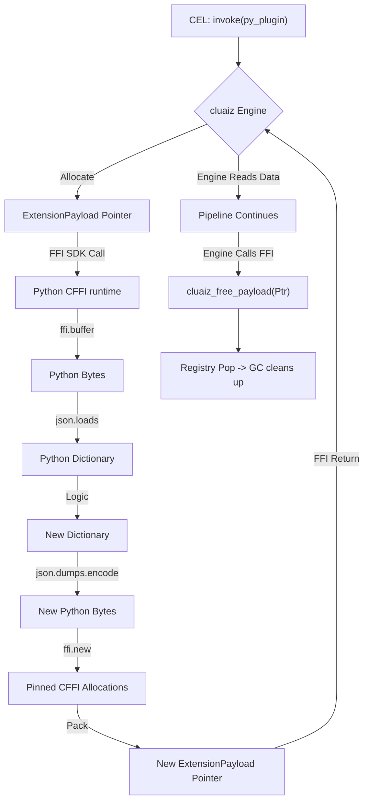

# CEL Python SDK

When building AI applications, Python is often the ecosystem of choice for running PyTorch or TensorFlow. However, running an HTTP server (like FastAPI) in Python just to receive data from cluaiz introduces massive serialization latency.

By using Python's `cffi` module, your Python ML models can directly read from the **CEL Native SDK** C-ABI memory struct.

## The Memory Struct

cluaiz passes an `ExtensionPayload` pointer to your Python plugin.

```c
typedef enum {
    Json = 0,
    Cdql = 1,
    WasmBinary = 2,
    RawBytes = 3,
    Bincode = 4
} PayloadType;

typedef struct {
    PayloadType payload_type;
    const uint8_t* data_ptr;
    size_t data_len;
} ExtensionPayload;
```

## Creating a Python SDK Plugin via CFFI

### 1. The Execution Function

```python
import cffi
import json

ffi = cffi.FFI()
ffi.cdef("""
    typedef enum { Json = 0, Cdql = 1, WasmBinary = 2, RawBytes = 3, Bincode = 4 } PayloadType;
    typedef struct {
        PayloadType payload_type;
        const uint8_t* data_ptr;
        size_t data_len;
    } ExtensionPayload;
""")

# Global registry to pin memory so Python's GC doesn't delete it
_pinned_buffers = {}

@ffi.callback("ExtensionPayload* (ExtensionPayload*)")
def process_data(input_ptr):
    # 1. Read the input struct
    payload_type = input_ptr.payload_type
    data_len = input_ptr.data_len
    
    # 2. Extract the raw bytes into a Python byte string
    buffer = ffi.buffer(input_ptr.data_ptr, data_len)[:]
    
    # Example: Parse JSON payload
    data = {}
    if payload_type == 0: # Json
        data = json.loads(buffer.decode('utf-8'))
        
    # 3. Perform Business Logic (e.g., PyTorch inference)
    data["prediction"] = "fraudulent"
    
    # 4. Serialize the output
    out_bytes = json.dumps(data).encode('utf-8')
    
    # 5. Allocate new memory for the engine to read
    # We must use ffi.new to allocate C-level memory, but keep a reference
    # in Python so the CFFI object isn't garbage collected early.
    out_c_data = ffi.new("uint8_t[]", out_bytes)
    out_payload = ffi.new("ExtensionPayload*")
    out_payload.payload_type = 0
    out_payload.data_ptr = out_c_data
    out_payload.data_len = len(out_bytes)
    
    # Pin the memory reference
    ptr_address = int(ffi.cast("intptr_t", out_payload))
    _pinned_buffers[ptr_address] = (out_payload, out_c_data)
    
    return out_payload
```

## Memory Management (Preventing Leaks)

Python, like Node.js, uses Garbage Collection. You allocated `ffi.new("ExtensionPayload*")` and `ffi.new("uint8_t[]")`. If you just return the pointer, the engine will read it, but Python will keep it in `_pinned_buffers` forever, causing an Out-of-Memory (OOM) error.

You **must** implement `cluaiz_free_payload`.

### 2. The Free Function

```python
@ffi.callback("void (ExtensionPayload*)")
def cluaiz_free_payload(ptr):
    if ptr == ffi.NULL:
        return
        
    ptr_address = int(ffi.cast("intptr_t", ptr))
    
    # Pop from the global registry. 
    # Without references, Python's GC will free the underlying C memory automatically.
    if ptr_address in _pinned_buffers:
        del _pinned_buffers[ptr_address]
```

## Architectural Flow


