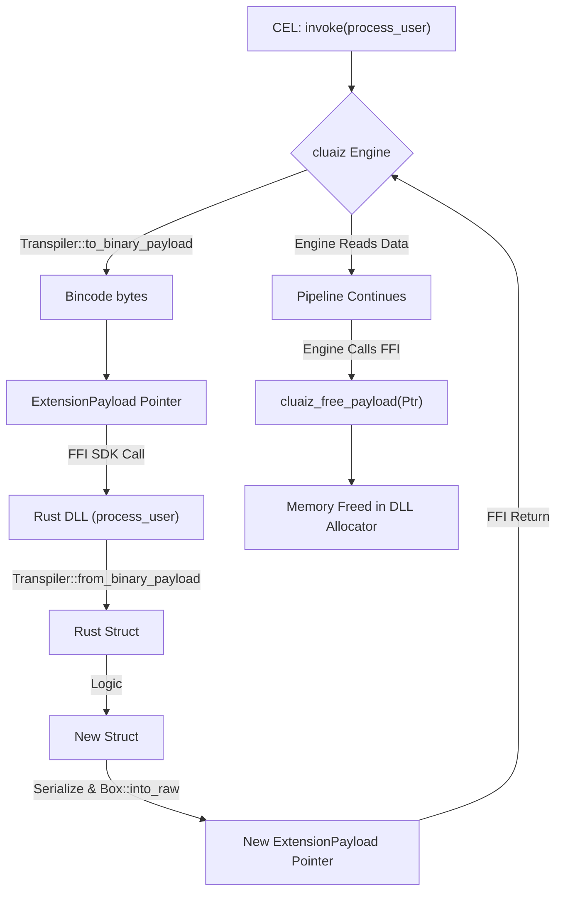

# CEL Native Rust SDK

Because the cluaiz Engine is built in Rust, native Rust plugins bypass WebAssembly sandbox serialization. However, to maintain decoupled ABIs, they still communicate via the **CEL Extension Protocol** — a strictly typed C-ABI FFI boundary.

## The Memory Struct

As defined in `inference-cel/src/ffi/cxp_ffi.rs`, all data moving between the executor and a plugin takes the shape of the `ExtensionPayload` struct:

```rust
#[repr(C)]
pub enum PayloadType {
    Json,
    Cdql,
    WasmBinary,
    RawBytes,
    Bincode, // Used for 0.05ms struct transfers
}

#[repr(C)]
pub struct ExtensionPayload {
    pub payload_type: PayloadType,
    pub data_ptr: *const u8,
    pub data_len: usize,
}
```

## Creating a Native SDK Plugin

Your plugin must compile to a dynamic library (`.so`, `.dylib`, `.dll`) exposing `extern "C"` functions that receive and return `ExtensionPayload`.

### 1. The Execution Function

```rust
use cluaiz_sdk::{ExtensionPayload, PayloadType, Transpiler};
use serde::{Serialize, Deserialize};

#[derive(Serialize, Deserialize)]
struct UserData {
    id: String,
    age: u32,
}

#[no_mangle]
pub extern "C" fn process_user(input: *const ExtensionPayload) -> *mut ExtensionPayload {
    unsafe {
        // 1. Read the input pointer
        let payload = &*input;
        let bytes = payload.as_bytes();

        // 2. Deserialize via Bincode (Transpiler)
        let mut user: UserData = Transpiler::from_binary_payload(bytes).unwrap();

        // 3. Perform Business Logic
        user.age += 1;

        // 4. Serialize back via Bincode
        let out_bytes = Transpiler::to_binary_payload(&user).unwrap();
        
        // 5. Allocate memory for the Engine to take ownership of
        let mut boxed_bytes = out_bytes.into_boxed_slice();
        
        let out_payload = Box::new(ExtensionPayload {
            payload_type: PayloadType::Bincode,
            data_ptr: boxed_bytes.as_mut_ptr(),
            data_len: boxed_bytes.len(),
        });

        // Leak the box so the Engine can read it across the FFI boundary
        Box::into_raw(out_payload)
    }
}
```

## Memory Management (Preventing Leaks)

Because you leaked a `Box` to pass the pointer across the boundary, the Engine will read it. However, the Engine's allocator cannot free memory created by your plugin's allocator. 

You **must** expose a `cluaiz_free_payload` function in your DLL so the Engine can ask your SDK plugin to clean up its own memory.

### 2. The Free Function

```rust
#[no_mangle]
pub extern "C" fn cluaiz_free_payload(ptr: *mut ExtensionPayload) {
    if ptr.is_null() { return; }
    unsafe {
        // Re-construct the Box and let Rust's ownership drop it naturally
        let payload = Box::from_raw(ptr);
        
        // Also drop the internal data buffer
        let _data_slice = std::slice::from_raw_parts_mut(
            payload.data_ptr as *mut u8, 
            payload.data_len
        );
        let _data_vec = Vec::from_raw_parts(
            _data_slice.as_mut_ptr(),
            _data_slice.len(),
            _data_slice.len(),
        );
    }
}
```

## Architectural Flow


