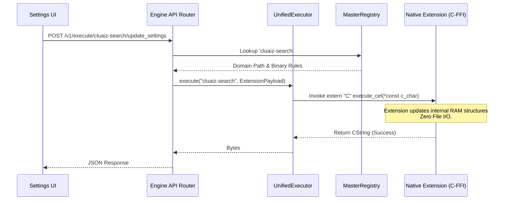

# Dynamic Ecosystem Execution Architecture

This document explains the internal mechanics of the cluaiz Engine's dynamic execution router, specifically focusing on how plugins and extensions receive dedicated API endpoints for dynamic settings manipulation without relying on static configuration files.

## The Architectural Need

Historically, extensions (like `cluaiz-search`) relied on local JSON files (e.g., `search_config.json`) for configuration. This introduced slow File I/O overhead and was fundamentally incompatible with the zero-latency, dynamically allocated memory architecture of the engine.

To solve this, the engine provides the **Dynamic Ecosystem Execution Route**:

```http
POST /v1/execute/{component_name}/{function_name}
```

When an extension, plugin, or MCP is downloaded and registered via the `MasterRegistry`, the engine automatically provisions this localhost API endpoint. This acts as a real-time, FFI-bridged configuration portal.

---

## Control Flow (Settings Manipulation)

Users or UI settings applications do not write to files. Instead, they hit the extension's dedicated API endpoint.

### Step 1: The API Call
A settings application sends a JSON payload to the Engine's API.
```json
// POST /v1/execute/cluaiz-search/update_settings
{
  "params": {
    "max_context_length": 8192,
    "timeout_secs": 5,
    "exclude_rules": "youtube.com"
  }
}
```

### Step 2: The Router Intercept (`routes.rs` -> `cel_handler.rs`)
The Engine's Axum router intercepts this request in `execute_dynamic()`. It skips standard CEL parsing. Instead, it converts the incoming JSON payload into binary bytes and wraps it in an `ExtensionPayload` using `PayloadType::Json`.

### Step 3: The Unified Executor (`sandbox.rs`)
The `UnifiedExecutor` looks up `cluaiz-search` in the `MasterRegistry`. It resolves the physical binary path and the execution envelope (`NATIVE` or `WASM`).

### Step 4: FFI Pointer Bridge
The executor passes a raw C-pointer (the serialized payload bytes) across the FFI boundary directly into the extension's memory space.

---

## System Diagram



## Hardware Awareness & The Think Hook

Beyond manual API calls, this architecture plays a critical role during inference (the "Pause & Pivot" or Think hook).

When the LLM outputs a CEL block mid-generation:
1. The token stream **pauses**.
2. The engine parses the CEL block into an Execution Plan.
3. The engine uses the **HardwareGovernor** to query active Silicon Truth parameters (e.g., available VRAM across GPUs).
4. The engine **injects** these hardware limits (like `max_ram_mb`) into the arguments.
5. The `UnifiedExecutor` invokes the extension via FFI, passing both the LLM's requested parameters and the hardware's hard limits simultaneously.
6. The extension executes and returns results.
7. The stream **resumes**.

This guarantees that an extension never consumes more resources than the engine permits at that exact microsecond.
