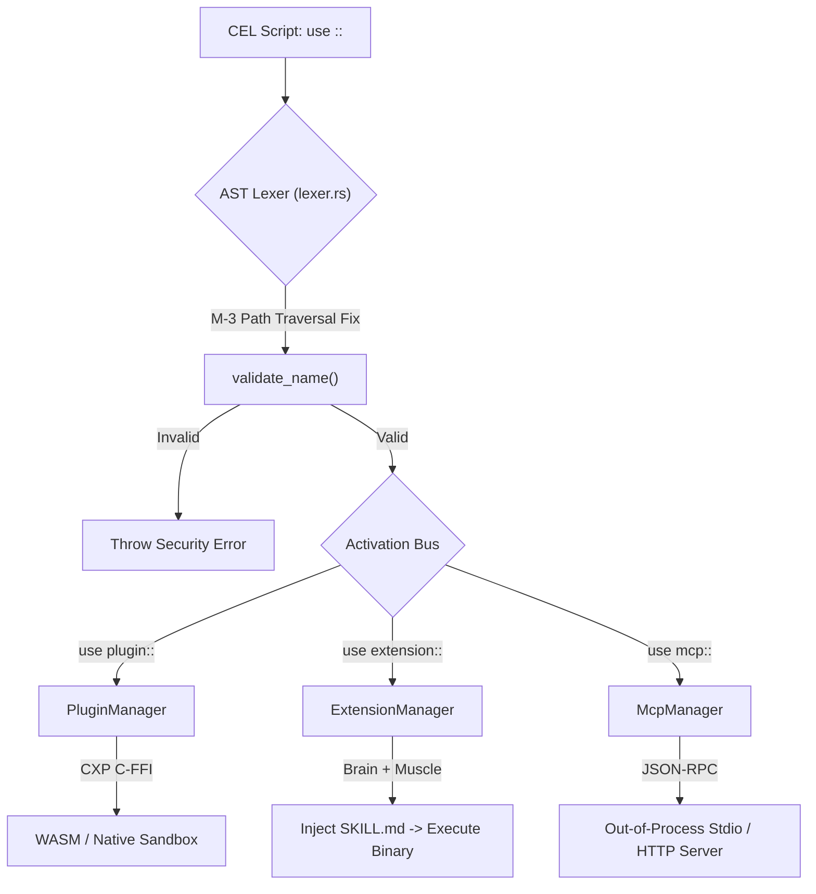

# Dynamic Linking (`use`)

cluaiz is built on a highly modular architecture. The core Engine (`inference-engine`) only handles execution, memory routing, and VRAM mapping. Actual capabilities (Web Scraping, Database I/O, API calling) are completely decoupled and loaded dynamically.

Unlike standard languages where `import` gives modules full access to your system, the cluaiz Engine operates a strict **Tripartite Registry**.

## The Architecture: How the Engine Routes Code

When the Engine cold-boots, it parses the `registry.yaml` and splits external modules into three distinct HashMaps managed by three separate Sub-Managers. 

Here is the exact hardware flow of how the `ActivationBus` handles the `use` directive:



---

## 1. The Core Differences (Skill vs Plugin vs Extension vs MCP)

Before jumping into syntax, you must understand how the Engine classifies these modules:

| Module Type | The Brain (`SKILL.md`) | The Muscle (Binary) | Format / Language | Sandbox Location | Isolation & Security | Engine Role & Example Use Case |
|---|---|---|---|---|---|---|
| **Skill** | ✅ Yes | ❌ No | Markdown / Text | None (Pure Text) | N/A (Just Context) | Injects context into the LLM. No execution happens here. <br>*(Example: Teaching the LLM how to write Python)* |
| **Plugin** | 🟡 Optional | ✅ Yes | `.wasm`, `.dll`, `.so` | In-Process (Engine RAM) | Strict Linear Memory Limits & Fuel Limits (WASM) | A highly-optimized binary. Can optionally have a SKILL.md to teach AI how to use it. <br>*(Example: Fast Math Parser)* |
| **Extension**| ✅ Yes | ✅ Yes (Multiple) | Markdown + Binary | In-Process (Engine RAM) | Manifest Engine Rules (e.g. Max 64MB RAM) | The Ultimate Union. Bundles one or multiple plugins with a SKILL.md brain. <br>*(Example: Custom Database Engine)* |
| **MCP** | 🟡 Optional | ❌ No (External) | JSON-RPC (HTTP/Stdio) | Out-of-Process | OS-Level (Separate Process) | Connects to standard Model Context Protocol servers. Can optionally provide Prompts/Instructions. <br>*(Example: Google Drive API)* |

---

## 2. The Plugin (`use plugin::`)

**The Functional Muscle.** 

Plugins are purely functional blocks of code compiled into WebAssembly (`.wasm`) or Native Shared Libraries (`.dll`, `.so`). They do not contain any AI logic or context.

* **Internal Manager:** `PluginManager`
* **Under the Hood:** 
  * If it's a `.wasm` file, the Engine loads it into a `DashMap` based global `WASM_CACHE`. It executes inside `wasmtime`'s linear memory.
  * If it's a `.dll`, the Engine uses Rust's `libloading` crate, strictly sanitizing the path via `std::fs::canonicalize`.
* **CEL Syntax:**
```cel
// 1. Loads the binary into the Engine's memory sandbox
let $web_tools = use plugin::web-scraper

// 2. Invokes a specific C-ABI entrypoint via the CXP pointer
let $html = $web_tools -> invoke(scrape_url, url: "https://example.com")
```

---

## 3. The Extension (`use extension::`)

**The Sangam (Union) of Brain and Muscle.** 

An extension is a complete subsystem. It has a `native/` folder containing the compiled binary (like a plugin), BUT it also has a `manifest-extension.yaml` and a `SKILL.md` (the Brain).

* **Internal Manager:** `ExtensionManager`
* **Under the Hood:** When `use extension` is called, it triggers a `LoadStrategy::LAZY` event. The Engine first reads the `SKILL.md` and injects its semantic rules into the LLM's active KV cache. Once the LLM generates a valid query, the Engine routes that query to the extension's binary for bare-metal execution.
* **CEL Syntax:**
```cel
// 1. Loads both the AI Context (SKILL) and the Binary Muscle
let $db = use extension::cluaiz-db

// 2. The LLM knows how to write this CDQL string because of the SKILL.md!
let $users = $db -> query("SELECT * FROM users WHERE age > 18")
```

---

## 4. Model Context Protocol (`use mcp::`)

**The Out-of-Process Connector.** 

cluaiz natively supports the [Model Context Protocol (MCP)](https://modelcontextprotocol.io/).

* **Internal Manager:** `McpManager`
* **Under the Hood:** The Engine stores the connection metadata (e.g., node script path, python server path) in its registry. When invoked, it **does not load any binary**. Instead, it spawns a child process or opens an HTTP/SSE stream and communicates via standard JSON-RPC. If the MCP server crashes, the Engine survives.
* **CEL Syntax:**
```cel
// Establishes a JSON-RPC stdio connection to the external MCP server
let $gdrive = use mcp::google-drive

// Sends an RPC request to the server, waiting for a JSON response
let $files = $gdrive -> call_tool(list_files, folder_id: "root")
```

---

## 🚨 Security & Memory Boxing

The Engine never blindly trusts a `use` directive.

1. **Fuel Limits (WASM Sandbox):** Before passing the CXP pointer to a `.wasm` file, the Engine wraps the execution in a `wasmtime::Store`. It injects `store.set_fuel(10_000)`. If a malicious plugin enters an infinite `while(true)` loop, it runs out of fuel and is instantly killed, protecting the host Engine.
2. **Lexer Security (M-3 Path Traversal Fix):** When the AST Lexer parses your `use` directive, it runs a hardcore `validate_name()` check. By strictly disallowing `/`, `\`, and `.`, the Engine makes directory traversal attacks mathematically impossible. A malicious AI prompt forcing `use plugin::../../etc/passwd` will crash at the AST Lexer natively before ever touching the filesystem.
