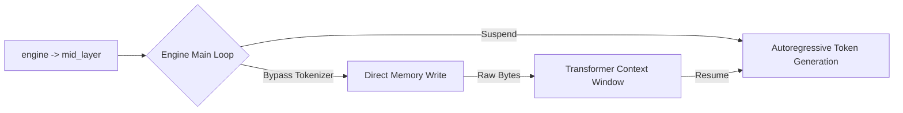

# Hardcore Engine Directives

Most CEL pipelines execute user-level operations (`filter`, `use plugin`, `invoke`). However, cluaiz is designed as a direct OS/Hardware interface for AI Agents. 

Sometimes, an Agent needs to manipulate its own physical runtime environment—clearing GPU VRAM, pausing thread execution, or spawning host processes. This is where **Engine Directives** come in.

## Syntax Overview
All engine directives start with the reserved `engine ->` keyword, followed by the subsystem they are targeting.

```cel
engine -> <subsystem> -> <action>
```

---

## 1. `kv_cache` Subsystem
Controls the Transformer's KV Cache allocation in the VRAM.

### `clear($target)`
When processing massive documents, the KV Cache fills up. An Agent can explicitly free memory before the OOM (Out Of Memory) killer triggers.

```cel
let $user = "user_404"
engine -> kv_cache -> clear($user)
```
- **Hardware Action:** The engine locates the GPU VRAM block assigned to `$user` and issues an atomic `cudaFree` or equivalent drop instruction.
- **Latency:** Zero-copy, strictly synchronous. The pipeline halts until memory is confirmed freed.

---

## 2. `mid_layer` Subsystem
Direct injection into the model's inference loop.

### `inject($payload)`
Normally, models generate tokens sequentially. Injection allows the Agent to abruptly insert structured data directly into the Transformer's attention layer, bypassing the tokenizer.

```cel
let $schema = use plugin::schema_db -> invoke(get, id: "json_schema_1")
engine -> mid_layer -> inject($schema)
```



- **Hardware Action:** Suspends the autoregressive generation loop, writes the raw string bytes directly into the context window's memory buffer, and resumes generation.

---

## 3. `inference` Subsystem
Thread scheduler controls.

### `pause()`
Used when the Agent is waiting on a slow external I/O call (like downloading a file) and wants to yield its GPU/CPU thread to another Agent.

```cel
engine -> inference -> pause()
```
- **Hardware Action:** Signals the Tokio runtime to yield the current blocking task.

---

## 4. `os` Subsystem
Direct host operating system interaction.

### `process("<command>")`
Spawns a shell subprocess on the host machine.

```cel
engine -> os -> process("ps aux | grep node")
```

```mermaid
flowchart TD
    A["engine -> os -> process"] --> B{"Lexer parser (lexer.rs)"}
    
    B -->|Emits| C["CelOp::SystemCall"]
    
    C --> D{"Planner / Executor"}
    D -->|Check| E{"EngineRules.allow_subprocess"}
    
    E -->|Some(true)| F["std::process::Command (Native Host)"]
    E -->|false / None| G["Throw Strict Security Fault (Halt)"]
```

- **M-1 Security Constraint:** The parser emits `CelOp::SystemCall`, but it does *not* execute it. The Engine Executor **must** verify that `EngineRules.allow_subprocess == Some(true)` before spawning the shell. If false, the engine throws an immediate strict security fault and terminates the pipeline.
- **Hardware Action:** Binds to `std::process::Command` natively.

---

## 🚨 Anti-Patterns & Dangers

> [!WARNING]
> **Never use Engine Directives for Application Logic**
> Engine Directives are meant for system administration and autonomous agent survival (memory management). Do not use `engine -> os -> process("ls")` to list files. Use `use plugin::file_system` instead. Bypassing plugins breaks the sandbox boundaries and makes your code un-portable across different operating systems.
