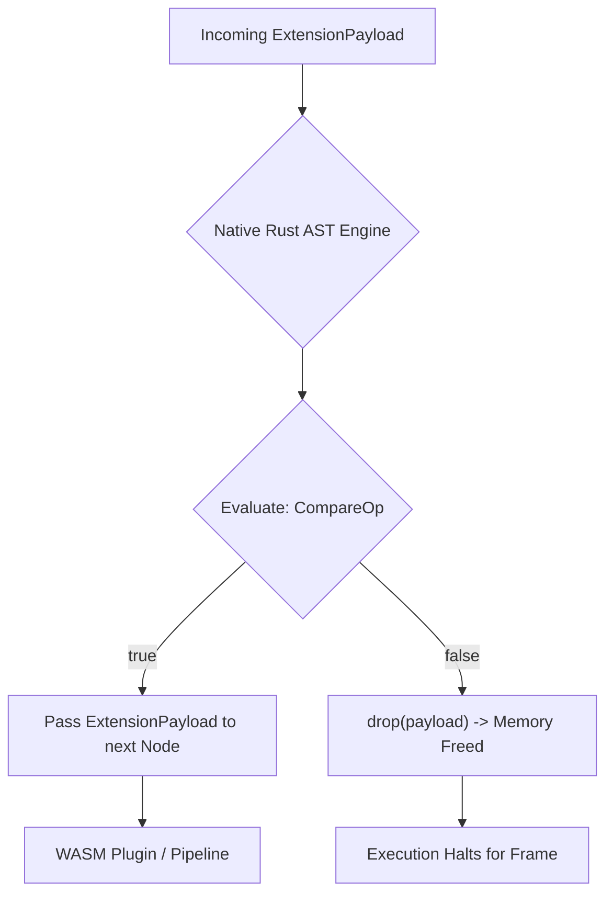

# The `filter` Pipeline Barrier

In traditional microservices, if you want to drop invalid data from an array, you load the whole array into V8 (Node.js) or Python, loop through it, and return a new array. This is slow and memory-intensive.

CEL's `filter` acts as an absolute memory barrier in the pipeline. 

## Syntax
```cel
<Pipeline> -> filter <field> <op> <value> -> <Next Pipeline>
```

## The Hardware Reality (Execution Drops)
When the CEL Engine encounters `filter`, it evaluates the condition locally inside the Rust host *without* invoking WASM plugins or serializing the payload.

```rust
// Internally in the Rust Engine (inference-cel/src/parser/ast.rs)
pub enum CelOp {
    Filter {
        field: String,
        op: CompareOp,
        value: CelValue,
    }
}
```



If the condition evaluates to `false`, the Rust Engine instantly calls `drop(payload)`. The pipeline execution for that frame halts immediately. Because this happens in native Rust using standard CPU comparison operators (and sometimes SIMD for vectorized data), the overhead is less than `1µs`.

## Deep Dive Example: Pre-Computation Filtering

Imagine you have a plugin that retrieves 10,000 analytics events, but you only want to process the ones where `user_id` matches.

```cel
let $events = use plugin::analytics -> invoke(fetch_events)

foreach ($event in $events) {
    // The filter drops 99% of events in 1 microsecond.
    // The heavy fraud_check plugin is ONLY invoked for matching events.
    $event -> filter user_id == "U-991" -> use plugin::fraud_check -> invoke(scan)
}
```

### Supported Native Operators
- `==` / `!=` (Equality Check)
- `>` / `<` / `>=` / `<=` (Numeric Comparison)
- `contains` (Checks if an array/string contains a value)

### Why not filter inside the Plugin?
If you pass the entire dataset into a WASM plugin and do the filtering inside Rust/WASM, you pay the FFI serialization cost for 10,000 items. By putting `filter` *before* the plugin invocation, the Engine prunes the data natively, meaning the WASM plugin only receives the exact memory pointer it needs to process.
