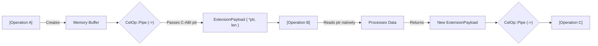

# Getting Started: The CEL Pipeline

> *"Everything in CEL is a data stream. Data flows left-to-right, crossing memory barriers instantly."*

The cluaiz Expression Language (CEL) is a pipeline-based, Turing-complete execution language. Unlike HTTP REST APIs where data is serialized to JSON and sent over the network, CEL executes **natively** inside the Rust Engine's memory space.

## The Pipeline Operator (`->`)

### What it does
The `->` (Pipe) operator is the heartbeat of CEL. It takes the output of the left operation and passes it as the input to the right operation. 

### Under the Hood (Hardware Reality)
When the CEL Planner parses `->` into the `CelOp::Pipe` AST node, it does **not** copy the data. Instead, it passes a 64-bit memory pointer to an `ExtensionPayload` C-ABI struct. 
This means moving 1 GB of data from one plugin to another takes exactly `0.00ms` because the data never actually moves in RAM. It's a zero-copy memory barrier.

### Syntax
```cel
[Operation A] -> [Operation B] -> [Operation C]
```

### Memory Pipeline Architecture


---

## Your First Plugin Invocation

The most common starting point for any CEL pipeline is retrieving data or triggering an action from a loaded plugin.

### Data Retrieval Pipeline
```cel
use plugin::file_system -> invoke(read_file, path: "/tmp/data.json") -> select(name, status)
```
**Execution Cost:** The CEL Planner bridges the WASM boundaries. The file system plugin returns a memory block, which is piped directly to the `select` projection operator without JSON serialization.

### The Filtered Stream
If you need to search a group of memory objects returned by a plugin, you can filter them instantly.

```cel
use plugin::network -> invoke(fetch_users) -> filter status == "active" -> limit 50
```
**Execution Cost:** The engine receives the memory array from the network plugin. The `(status == "active")` is evaluated *during* the pipeline stream natively in Rust. If a record doesn't match, its memory slice is dropped before being passed downstream.

---

## Bringing it Together: A Basic API Call

In a traditional Node.js backend, you might do this:
1. Await Network/External Service Call
2. Map over JSON array
3. Return response

In CEL, it is a single execution string sent to the `cel://local/executor`:
```cel
use plugin::orders -> invoke(fetch_pending) -> filter amount > 1000 -> use plugin::stripe -> invoke(charge)
```

1. **`invoke(fetch_pending)`**: Streams orders from the plugin.
2. **`filter`**: Drops orders `< 1000` from memory natively.
3. **`use plugin`**: Loads the Stripe WASM DNA.
4. **`invoke`**: Executes the WASM function, passing the remaining memory pointer.

All of this happens inside the engine without a single HTTP hop between the micro-services.
