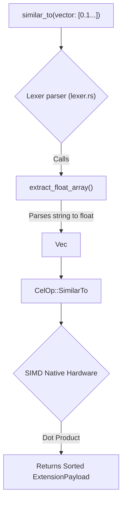

# Vector Search (`similar_to`)

AI systems constantly need to compare vector embeddings. Doing this in Python or Node.js requires loading massive arrays into memory, creating massive Garbage Collection spikes. 

The cluaiz Engine provides a native `similar_to` directive that hooks directly into SIMD (Single Instruction, Multiple Data) or GPU hardware for ultra-fast vector dot-product computations.

## Syntax
```cel
<Pipeline> -> similar_to(vector: [0.1, 0.4, -0.2...], metric: "cosine")
```

## The Hardware Reality (Native SIMD Execution)

In the `lexer.rs` file, vector literals `[...]` are parsed directly into `Vec<f32>` arrays in Rust. 

```rust
// Internally in the Engine (inference-cel/src/parser/ast.rs)
pub enum CelOp {
    SimilarTo {
        vector: Vec<f32>,
        metric: String,
    }
}
```



When the executor hits `SimilarTo`, it does NOT pass this data to a plugin. It natively executes the SIMD comparison algorithm (`cosine`, `euclidean`, or `dot_product`). This prevents cross-boundary FFI overhead when you just need to sort a stream by similarity.

## Usage Example: AI Search

You can fetch a batch of records from a service and instantly sort them by similarity to an input vector.

```cel
// 1. Fetch raw data
let $products = use plugin::catalog -> invoke(fetch_electronics)

// 2. Process and filter locally
$products 
    -> filter in_stock == true 
    -> similar_to(vector: [0.15, -0.02, 0.99], metric: "cosine") 
    -> limit 10
```

> [!WARNING]
> While `similar_to` uses SIMD, running it against millions of vectors inside the CEL memory stream is still an `O(N)` linear scan. For massive datasets, you should rely on your database's native HNSW or IVF indexes (via plugin invocations) rather than passing the whole dataset into the CEL pipeline.

