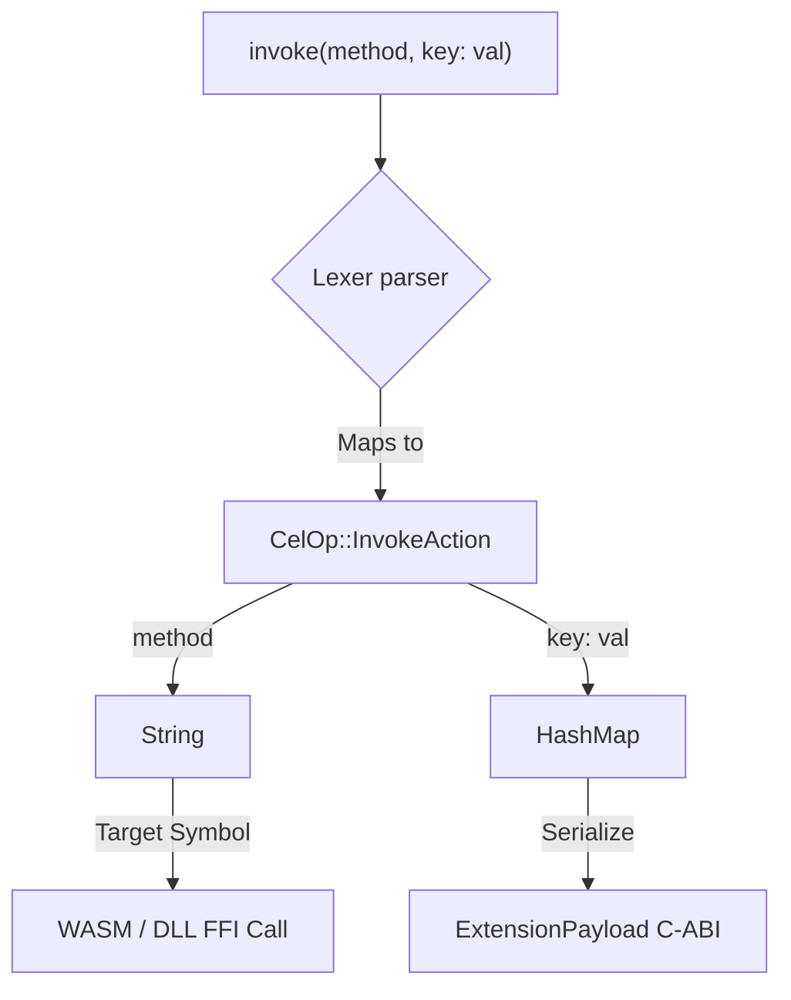

# Executing Plugin Functions (`invoke`)

Once a plugin is loaded into memory via `use plugin`, you need to execute specific functions within it. Because cluaiz plugins can be written in Rust, C++, Python, or JavaScript, the `invoke` command handles the dangerous task of crossing the Foreign Function Interface (FFI) boundary.

## Syntax
```cel
<Pipeline> -> invoke(<method_name>, <arg_key>: <arg_value>)
```

## The Hardware Reality (Under the Hood)
When the parser encounters `invoke`, it maps to `CelOp::InvokeAction`.

```rust
// Internally in the Engine (inference-cel/src/parser/ast.rs)
pub enum CelOp {
    InvokeAction {
        method: String,
        args: HashMap<String, CelValue>,
    },
}
```



**The C-ABI Struct:**
You cannot simply pass a Rust `String` or `Vec` into a Python or C++ plugin; it will cause a segfault. The Engine intercepts the `invoke` command and packs the data (and any arguments) into a strictly aligned C-ABI struct called `ExtensionPayload`.

```rust
#[repr(C)]
pub struct ExtensionPayload {
    pub payload_type: i32,
    pub data_ptr: *mut u8,
    pub data_len: usize,
}
```
The Engine passes this exact memory pointer to the plugin. 

## Memory Management (Preventing Leaks)
Because `invoke` hands a raw memory pointer over to a plugin, memory leaks are a major risk. To prevent this, the Engine enforces a strict rule: **The Plugin must implement and call `cluaiz_free_payload`**.

If the `invoke` command completes and the plugin has not correctly freed the memory pointer using the Engine's allocator, the Engine will detect it, flag a memory leak, and can forcibly tear down the sandbox.

## Examples

### 1. Simple Invocation (No Args)
This takes the active memory stream and passes it to the `clean_text` method of the active plugin.
```cel
let $raw_text = "   Dirty Text   "
$raw_text -> use plugin::formatter -> invoke(clean_text)
```

### 2. Invocation with Arguments
You can pass additional configurations into the plugin via arguments. These arguments are packed into a hashmap and sent alongside the main payload.
```cel
use plugin::math -> invoke(calculate_fibonacci, depth: 50, fast_mode: true)
```
