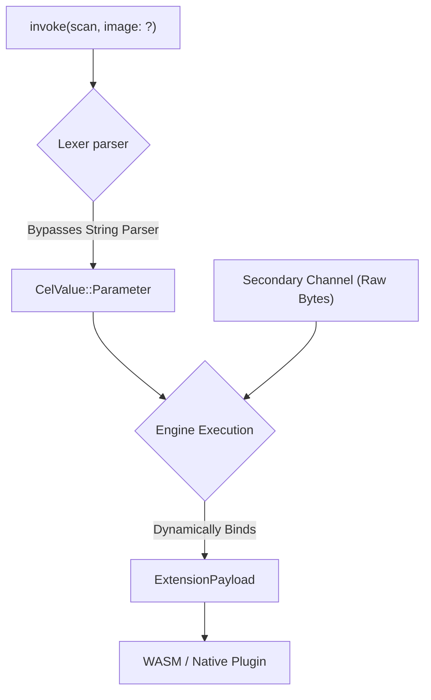

# Parameterized Queries (`?`)

When dealing with massive strings or raw binary data (like a 2MB image buffer or a massive JSON object), injecting it directly into a string pipeline is dangerous and extremely slow. 

CEL supports Parameterized Queries using the `?` placeholder, similar to SQL prepared statements, but heavily optimized for direct memory mapping.

## Syntax
```cel
use plugin::vision -> invoke(scan, image: ?)
```

## The Hardware Reality (Under the Hood)
When the parser encounters `?` (as seen in `lexer.rs`), it maps it to `CelValue::Parameter`.

```rust
// Internally in the Engine (inference-cel/src/parser/ast.rs)
pub enum CelValue {
    Parameter, // Maps to `?`
}
```



Instead of trying to parse a massive string, the Engine halts AST parsing for that argument. The actual data is passed through a **secondary execution channel** (a direct TCP buffer or FFI struct pointer). When the Pipeline executes, the Engine dynamically swaps the `?` with the raw memory pointer.

### Why this is critical for Agents
If your Agent is downloading a file from the internet, you never want that file's bytes converted to a string and evaluated by the AST parser. You use `?` to keep the bytes out of the AST logic entirely.

## Usage Example
You can use `?` anywhere a value is expected.

```cel
// The actual ID string is provided in the secondary execution payload
use plugin::filesystem -> invoke(get_file, id: ?) 

// The image bytes bypass the parser
let $result = use plugin::ocr -> invoke(read, image_bytes: ?)
```
