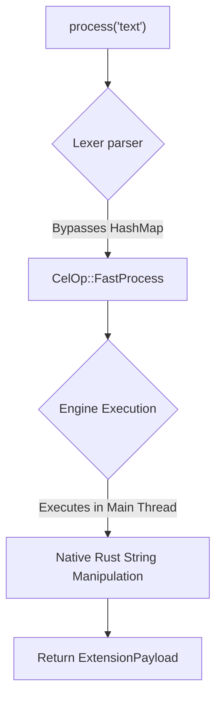

# Fast Path Execution (`process`)

Sometimes you just need to do a simple string manipulation, like lowercasing a string, replacing a word, or running a basic regex. 

Loading a full WASM plugin via `use plugin::string_tools` just to lowercase a string is incredibly inefficient. It requires allocating a `wasmtime::Store`, setting up memory boundaries, and crossing the FFI boundary. 

The `process` operator bypasses this entirely.

## Syntax
```cel
<Pipeline> -> process("<method>", <args>)
// Or shortcut for direct string replacement/injection:
process("Hello, World!")
```

## The Hardware Reality (Under the Hood)
When the parser hits `process`, it maps to `CelOp::FastProcess`.

```rust
// Internally in the Engine (inference-cel/src/parser/ast.rs)
pub enum CelOp {
    FastProcess {
        method: String,
        payload_text: String,
    }
}
```



The Engine intercepts this command *before* it ever reaches the WASM Sandbox or Plugin Manager. It executes the manipulation natively in the Engine's primary Rust thread. If the manipulation is supported, it runs directly against the CPU (often utilizing SIMD registers for string scanning).

## Usage Examples

### 1. Direct String Injection
Often used in `if/else` fallbacks to inject a raw string into the pipeline without needing a database.
```cel
if ($user.role != "admin") {
    process("Access Denied")
}
```

### 2. Native String Methods (Planned)
Executing basic native Rust string methods without WASM overhead.
```cel
let $text = "   Unformatted Text   "
$text -> process(trim) -> process(to_lowercase)
```

## When NOT to use `process`
Because `process` runs on the primary Engine thread, it must be `O(1)` or extremely fast `O(N)`. You cannot use `process` for heavy tasks (like parsing massive JSON trees or running heavy regex on megabytes of text), because it will block the Engine's `tokio` event loop.

For heavy, blocking CPU work, **always** use `use plugin` so the work is sandboxed in a separate WASM execution thread, allowing the primary Engine to remain responsive.
