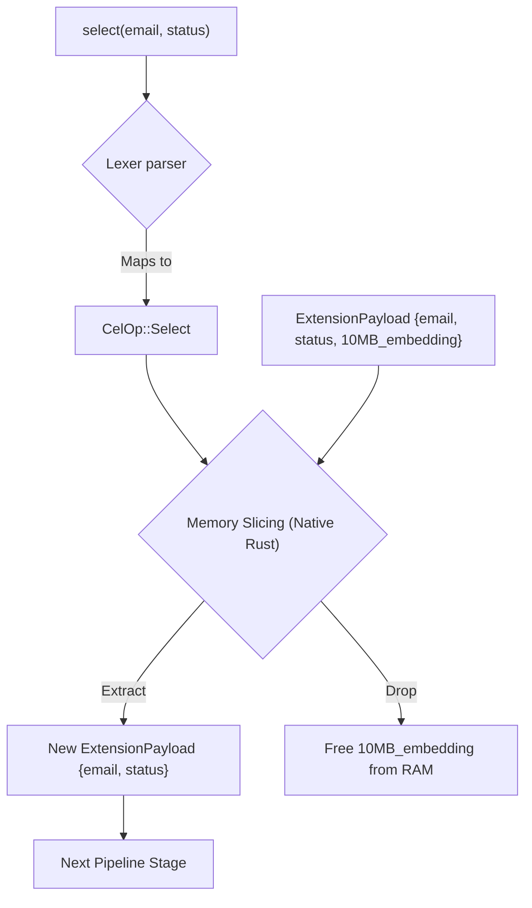

# Memory Projection (`select`)

In AI Agent architectures, records are often massive. A `User` record might contain a 10MB embedding array, a 500KB chat history, and basic info like `name` and `email`.

If you load 1,000 users into memory, you consume Gigabytes of RAM. If you only needed their `email` addresses to send a notification, you have caused a massive memory bloat. The `select` command prevents this.

## Syntax
```cel
<Pipeline> -> select(<field1>, <field2>, ...)
```

## The Hardware Reality (Under the Hood)
When the parser hits `select`, it maps to `CelOp::Select`.
```rust
// Internally in the Engine (inference-cel/src/parser/ast.rs)
pub enum CelOp {
    Select {
        fields: Vec<String>,
    }
}
```



The Engine takes the active `ExtensionPayload` memory struct. It iterates through the payload, allocates a new, smaller memory block containing **only** the specified keys, and immediately drops the original massive block.

This is fundamentally different from filtering (`filter`). `filter` drops *entire records* based on conditions. `select` reshapes (projects) the records to be smaller.

## Deep Dive Example: Preventing VRAM OOM

**❌ Bad Approach (VRAM Bloat):**
```cel
let $users = use plugin::auth -> invoke(get_users, status: "active")
// $users holds 1,000 records, each 10MB (total 10GB RAM)

foreach ($u in $users) {
    use plugin::email_sender -> invoke(send, to: $u.email)
}
```
*Why it fails:* The agent consumes 10GB of RAM just to hold data it isn't using.

**✅ Optimized Zero-Latency Approach:**
```cel
let $emails = use plugin::auth -> invoke(get_users, status: "active") -> select(email)
// $emails holds 1,000 records, each 50 bytes (total 50KB RAM)

foreach ($e in $emails) {
    use plugin::email_sender -> invoke(send, to: $e.email)
}
```
*Why it succeeds:* The Engine instantly strips the 10MB embeddings from memory before assigning the variable, reducing memory overhead by 99.99%.

## Select vs Plugin Projections

If possible, it is always faster to project data inside the external plugin or API before returning it to CEL, so the payload over the FFI boundary is smaller. Use `select` when dealing with thick data returned from external Plugins where you don't control the plugin's internal response schema.
