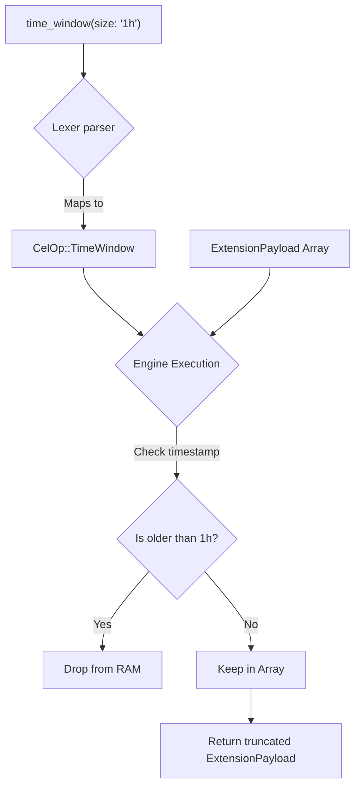

# Active Context Management (`time_window`)

When building continuous AI Agents, the context window (history) grows infinitely. If you feed 1,000,000 tokens of history into a Transformer model, you will exhaust your GPU's KV Cache and trigger an OOM (Out of Memory) crash.

The `time_window` operator is a native memory-management tool designed to strictly truncate the working set based on time before passing it to the Inference Engine.

## Syntax
```cel
<Pipeline> -> time_window(size: "<duration>")
```

## The Hardware Reality (Under the Hood)
When the parser hits `time_window`, it maps to `CelOp::TimeWindow`.

```rust
// Internally in the Engine (inference-cel/src/parser/ast.rs)
pub enum CelOp {
    TimeWindow {
        size: String,
    }
}
```



**Sliding Window Truncation:**
Instead of counting tokens (which is expensive and requires a tokenizer), `time_window` looks at the `timestamp` metadata attached to the memory payloads. The Engine natively slices the data array, instantly dropping any memory block older than the specified duration.

This guarantees that the data passed to the Transformer's attention layer is bounded, protecting the KV Cache from overflow.

## Supported Durations
The `size` parameter accepts standard time shorthand:
- `"1h"` (1 Hour)
- `"30m"` (30 Minutes)
- `"1d"` (1 Day)
- `"5s"` (5 Seconds)

## Deep Dive Example: Safe Agent State

**❌ Bad Approach (Infinite Context):**
```cel
let $chat_history = use plugin::message_queue -> invoke(get_messages, session: "session_123")
$chat_history -> use plugin::llm -> invoke(generate_reply)
```
*Why it fails:* On day 10, `$chat_history` might contain 500,000 tokens. The `llm` plugin will crash the GPU trying to load it.

**✅ Optimized Zero-Latency Approach:**
```cel
let $chat_history = use plugin::message_queue -> invoke(get_messages, session: "session_123")
$chat_history 
    -> time_window(size: "1h") 
    -> use plugin::llm 
    -> invoke(generate_reply)
```
*Why it succeeds:* The Engine natively drops all messages older than 1 hour from the RAM buffer *before* passing the pointer to the `llm` plugin. The GPU is perfectly safe.
