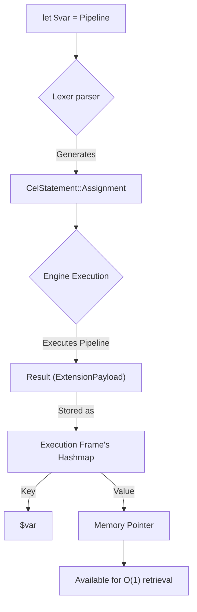

# Variable Assignments (`let`)

In complex backend flows, you often need to fetch data once and use it multiple times. If you make multiple plugin calls for the same data, you waste CPU cycles and IO bandwidth.

CEL solves this natively using the `let` assignment keyword.

## Syntax
```cel
let $<variable_name> = <Pipeline>
```

## The Hardware Reality (Under the Hood)
When the parser hits `let`, it creates an `Assignment` AST node. 
The Engine evaluates the right-hand `<Pipeline>`, converts the result into a `CelValue`, and stores it in the **Execution Frame's Hashmap**.

```rust
// Internally in the Engine (inference-cel/src/parser/ast.rs)
enum CelValue {
    Text(String),
    Vector(Vec<f32>),
    Variable(String), // The pointer to the hashmap entry
}
```


This means the variable lives entirely in RAM for the exact millisecond duration of the script execution. As soon as the script finishes, the Hashmap is dropped, preventing memory leaks.

## Example: Saving RAM and CPU

**❌ Bad Approach (High CPU Thrashing):**
```cel
if (use plugin::auth -> invoke(get_user, id: "123") -> select(is_admin) == true) {
    use plugin::auth -> invoke(get_user, id: "123") -> use plugin::permissions -> invoke(upgrade)
}
```
*Why it's bad:* You cross the WASM FFI boundary twice to fetch the exact same memory object.

**✅ Optimized Zero-Latency Approach:**
```cel
let $user = use plugin::auth -> invoke(get_user, id: "123")

if ($user.is_admin == true) {
    $user -> use plugin::permissions -> invoke(upgrade)
}
```
*Why it's good:* The record is fetched once and pinned in the RAM hashmap as `$user`. The subsequent pipeline accesses the memory pointer directly.

## Rules for Variables
1. **Always prefix with `$`**: Variable names must start with a dollar sign (e.g., `$data`, `$token`).
2. **Immutable Re-assignment**: Variables can be overwritten, but they always drop the old memory block entirely (no garbage collection lag, Rust's ownership model handles it instantly).
