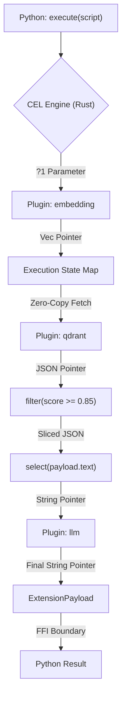

# CEL Usecase: RAG Pipeline

Retrieval-Augmented Generation (RAG) pipelines often suffer from high latency because they rely on slow Python data structures and HTTP loops between vector databases and LLMs. By using the **CEL Native SDK**, you can execute the entire pipeline natively in Rust without the data ever crossing the FFI boundary back to Python until the final string is ready.

## The Pipeline

This pipeline:
1. Embeds the user query.
2. Searches the Vector DB.
3. Filters results by score.
4. Injects the results into an LLM prompt.

```cel
let $query = ?1
let $embeddings = use plugin::embedding -> invoke(embed, text: $query)

let $context = use plugin::qdrant 
    -> invoke(search, vector: $embeddings, top_k: 5)
    -> filter(score >= 0.85)
    -> select(payload.text)

use plugin::llm -> invoke(chat, prompt: "Answer using this context: " + $context + ". Question: " + $query)
```

## Executing from Python SDK

Because of the Native SDK, the massive float arrays (embeddings) never enter Python's slow GIL (Global Interpreter Lock). They are allocated in Rust, passed to the Vector DB plugin natively, and dropped instantly.

```python
import cluaiz_sdk

cel_script = """
let $query = ?1
let $embeddings = use plugin::embedding -> invoke(embed, text: $query)

let $context = use plugin::qdrant 
    -> invoke(search, vector: $embeddings, top_k: 5)
    -> filter(score >= 0.85)
    -> select(payload.text)

use plugin::llm -> invoke(chat, prompt: "Answer using this context: " + $context + ". Question: " + $query)
"""

# The query is passed as a Parameter (?1) to prevent injection
user_question = "What is the memory architecture of cluaiz?"

# Execution happens entirely in Rust/WASM sandboxes
final_answer = cluaiz_sdk.execute(cel_script, [user_question])

print(final_answer)
```

## Architectural Data Flow


