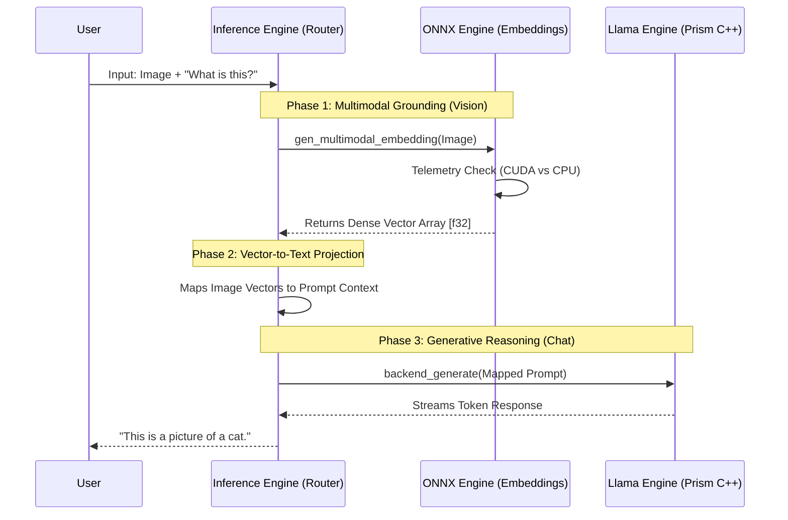

# Dual-Engine Architecture: Llama (Prism) ✕ ONNX

## 1. The Core Split: Why Two Engines?
The cluaiz system does not rely on a single monolithic neural backend. Instead, it employs a **Dual-Engine Synergy** to offer maximum hardware compatibility and operational flexibility.

* **Llama (Archer Prism):** A specialized, ultra-low-latency C++ kernel focused on raw autoregressive token generation for reasoning and chat.
* **ONNX Runtime:** A highly concurrent, universal engine. Originally designed for vector embeddings (Text RAG, Vision), **it now fully implements the `UnifiedBackend` trait**. This means ONNX can natively load Chat models, stream text, and perform autoregressive generation identical to Llama, all while leveraging hardware acceleration (CUDA/AVX).

## 2. Llama Interface (The Generative Core)
The Llama bridge (`interface-engines/llama/src/bridge.rs`) does not use standard high-level Rust bindings. It uses a low-level custom FFI (Foreign Function Interface) called the **InternalPrismBridge**.
* **Dynamic Resolution:** It dynamically locates the C++ kernel (`archer_prism.dll` or `.so`) at runtime, completely avoiding fragile hardcoded paths.
* **C-FFI Pointers:** It leverages raw C-pointers (`create_backend`, `backend_generate`) to pass strings directly into the C++ neural network's memory space, bypassing Rust's memory allocator to achieve zero-copy latency.
* **Responsibility:** Generating the final response tokens that stream back to the UI.

## 3. ONNX Interface (The Universal & Multimodal Engine)
The ONNX engine (`interface-engines/onnx/src/chat.rs` and `engine.rs`) is not just an embedder; it is a full-fledged inference backend implementing `UnifiedBackend`.
* **Chat Generation & JIT Support:** ONNX natively supports autoregressive text generation (`generate_stream`) and handles KV cache manipulation (`forward_raw`). It supports Mid-Layer JIT Injection identically to Llama.
* **Concurrency Session Pools (For RAG):** For text embeddings (e.g., `bge-m3`), it spawns a highly concurrent **Session Pool** (N sessions based on physical CPU cores). This allows the engine to embed multiple documents simultaneously.
* **Vision Singleton:** For massive vision models (e.g., CLIP), it restricts the pool to exactly 1 session to conserve critical VRAM.
* **Dynamic Telemetry Routing:** Before loading an ONNX graph (Chat or Vision), it probes physical hardware via `get_pulse()`. If VRAM is safe (>2GB free and <95% pressure), it mounts the ONNX graph onto the **GPU (CUDA)**. If VRAM is choked by the Llama model, it safely falls back to **CPU AVX** execution to prevent an OOM blue screen.

## 4. Cross-Support Flow (The Master Router)
The main `inference-engine` acts as the **Master Router**. It orchestrates the flow of data between these two physically separate memory domains.

## 5. Conflict Management (VRAM Arbiter)
Because ONNX (managed by `ort`) and Llama (managed by C++ `malloc`) do not inherently share a memory allocator, they could theoretically fight for the same GPU VRAM and crash the system.
The Master Router's `system_booster` solves this. If a user triggers `BoosterMode::MaxBoost` (`n_gpu_layers: -1`), the engine prioritizes Llama for 100% of the VRAM. The ONNX engine detects this pressure and automatically shifts its embedding workloads to the CPU, guaranteeing that the LLM generation loop never stutters.
