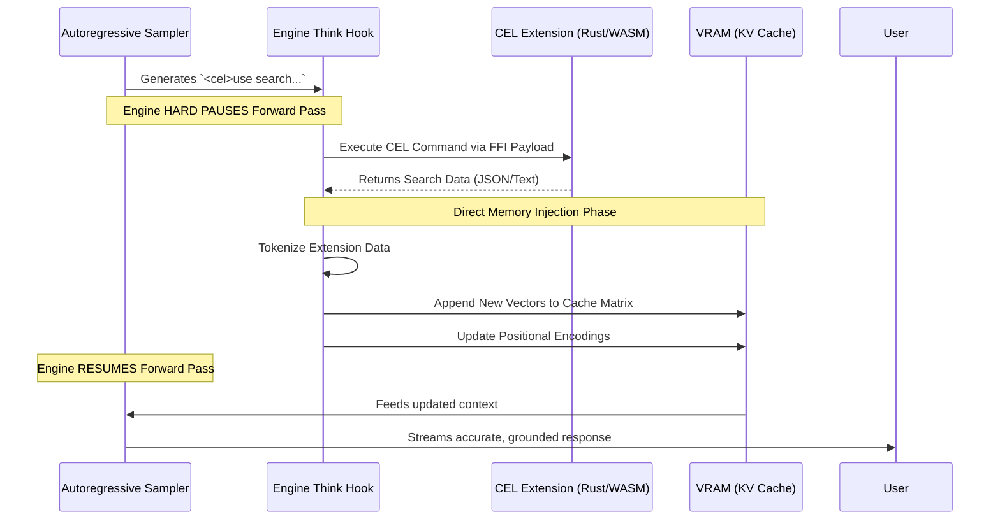

# JIT (Just-In-Time) Injection Architecture

## 1. The Core Philosophy of Mid-Layer Intervention
Traditional Large Language Models (LLMs) operate on a strictly linear, autoregressive loop: they ingest a prompt, calculate the attention matrix, and stream out tokens until they hit a stop sequence. If the model lacks information midway through a sentence, it hallucinates.

**cluaiz JIT Injection** shatters this limitation. It provides the Inference Engine with the capability to physically halt the tensor math during a forward pass, dynamically query an external extension (like a Search or Math Plugin), inject the raw results directly into the model's active memory (KV Cache), and resume generation as if the model always knew the answer.

## 2. The Mechanics of the "Think Hook"

The JIT pipeline is triggered by the engine's internal **Think Hook**. This is a micro-parser running parallel to the sampler.

1. **Detection**: During text generation, if the AI streams a designated tag (e.g., `<cel>use ext::search...</cel>`), the Think Hook intercepts the token stream before it is rendered to the user.
2. **Execution Halt**: The C++ inference core (llama.cpp/ONNX) is paused. The current state of the computation graph is locked, preserving the exact state of all neural layers.
3. **Payload Dispatch**: The Engine bridges to Rust via FFI, reads the `Permission.json` (specifically verifying `mid_layer_jit_injection: true`), and routes the CEL payload to the requested extension (e.g., `cluaiz-search`).
4. **Context Compaction (Optional)**: If the extension returns a massive payload (e.g., a 10,000-word webpage), the engine compresses it using a smaller internal embedding model before injection, ensuring the primary LLM's context window isn't blown out.

## 3. Engine-Agnostic Support (Llama & ONNX)

A critical architectural feature of cluaiz is that **JIT Injection is Engine-Agnostic**. It works flawlessly across both backend execution environments:
* **Llama (Archer Prism)**: The C++ core natively exposes `cluaiz_kernel_dump_kv_cache` and `load_kv_cache` FFI bindings.
* **ONNX Runtime (`chat.rs`)**: Because ONNX implements the `UnifiedBackend` for chat models, it explicitly manages its own `active_kv_cache` in Rust. During its `forward_raw` pass, it maps the injected KV tensors (`past_key_values`) directly into the ORT session.

Both engines allow the Master Router to surgically alter their memory state mid-generation.

## 4. KV Cache Vector Injection (The Magic)

Unlike traditional agentic frameworks (which append the search result to the text prompt and force the LLM to re-read the entire history from scratch), cluaiz does **not** recompute the prompt.

When the extension returns data:
1. The engine instantly converts the new text into embeddings.
2. It pushes these embeddings directly into the tail of the **Key-Value (KV) Cache** matrix in VRAM.
3. The engine increments the positional encoding sequence.
4. The generation loop is unpaused.

To the neural network, there was no interruption. It simply "remembers" the new facts as if they were part of the original prompt, resulting in a zero-latency continuation of the response.

## 4. Architectural Flow Diagram

## 5. Security & Isolation
Because JIT Injection writes directly to the model's memory pointer, it is the most privileged operation in the cluaiz ecosystem. 
* It is governed strictly by the `mid_layer_jit_injection` flag in `manifest-extension.yaml`.
* If a plugin attempts to inject corrupted tensors or exceeds its allocated memory budget, the `SystemBooster` Arbiter instantly terminates the FFI thread, flushes the tainted KV block, and returns an error token to the AI, preventing a full engine crash.
