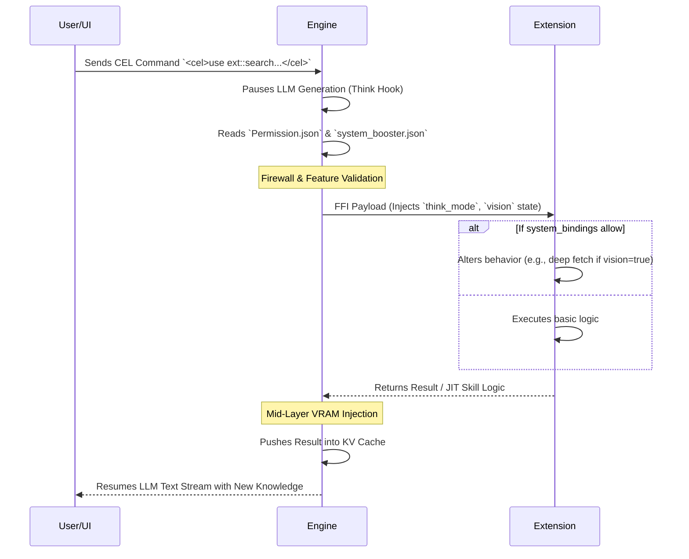

# cluaiz Engine Permissions - Architecture & Security Doctrine

## 1. System Overview
The `Permission.json` is the absolute sovereign policy file for the cluaiz Inference Engine. It acts as the primary firewall and capability router, determining exactly what hardware resources (models), data flows (vectorization), and sandboxed privileges (WASM) are permitted during runtime. 

Unlike static configuration files, this file dictates the **Backend Power Dynamics**—how the engine orchestrates its telemetry and handles JIT (Just-In-Time) extension requests.

## 2. Capability Architecture & Memory Mapping

### A. Vector Models (`vector_models`)
Controls the memory boundaries for RAG and semantic routing.
* **`text`**: (e.g., `clip:vit-base:onnx:fp32`) Defines the primary mathematical space for text embeddings. 
* **`vision` & `audio`**: If `null`, the engine completely locks the VLM/Audio sub-engines, freeing up dedicated VRAM chunks that would otherwise be reserved for multimodal tensor allocations.

### B. Chat Models (`chat_models`)
* Dictates the primary autoregressive Core LLM (`text`). The engine reads this to allocate the massive primary KV Cache buffer. 

### C. WebAssembly Security (`wasm_firewall`)
When an extension asks for execution power via the `/v1/cel/execute` endpoint, this firewall determines its OS-level syscall access:
* **`auto`**: The engine creates an isolated ring-buffer for the WASM payload, granting only the specific `file_system` or `network_access` defined in the extension's YAML manifest.
* **`strict`**: Absolute lockdown. All host bindings (FFI) are severed except for STDIN/STDOUT. Network sockets and file I/O will instantly throw a backend trap (segfault).

## 3. Data Telemetry & RAG Pipeline

* **`vectorize_user_input` / `vectorize_ai_response`**: 
  When set to `true`, the engine spawns an asynchronous background thread. For every conversational turn, the text is streamed through the `vector_models.text` graph, converted into high-dimensional vectors, and written to the LMDB local vector store. This creates a perpetual, searchable memory without stalling the main UI generation loop.
* **`temporary_chat_ttl_hours`**: The Engine's Garbage Collector (GC) scans the database and forcefully drops old chat buffers that exceed this TTL, preventing disk bloat.

## 4. Architectural Flow: Extension JIT Control

The following diagram illustrates how user settings in `Permission.json` actively govern what power an extension actually gets during a JIT execution event.

