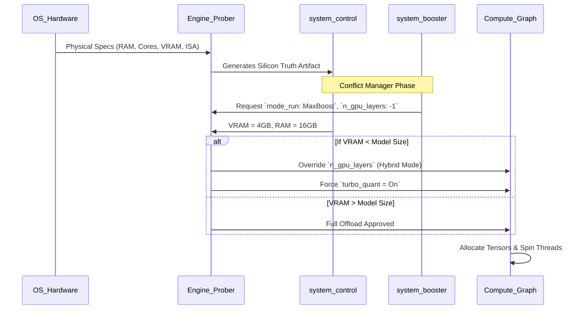

# cluaiz System Control - Silicon Truth & Hardware Telemetry

## 1. System Overview
The `system_control.json` is not a user-editable configuration. It is a read-only **Silicon Truth** artifact generated by the Engine's hardware probing systems. It serves as the absolute baseline for how the backend allocates backend power, scales thread concurrency, and schedules tensor computations.

When a user manipulates `system_booster.json` (like changing `mode_run`), the Engine cross-references those requests against `system_control.json` to ensure the hardware can physically handle the requested power.

## 2. Hardware Mapping Protocol

### A. Identity & Host Telemetry
* **`identity`**: Maps the OS target and CPU architecture. The Engine uses this to compile JIT dependencies or dispatch specific OS syscalls (e.g., `VirtualLock` on Windows vs `mlock` on Linux).
* **`brain.cluaizdb_connect_ffi`**: A critical state flag indicating if the Rust backend has achieved a low-latency IPC/FFI lock on the `cluaizdb` database engine.

### B. Silicon Truth: CPU Topology
* **`cpu.physical_cores` & `cpu.logical_threads`**: Used directly by the threading scheduler. If the user sets `mode_run: "MaxBoost"`, the engine claims `logical_threads - 1` for tensor math, locking them at real-time priority.
* **`cpu.isa_features` (AVX2, FMA3)**: Dictates which highly optimized assembly routines (BLAS kernels) are dispatched during CPU inference.

### C. Silicon Truth: Memory Bandwidth
* **`memory.available_capacity_gb`**: The ultimate gatekeeper. Before the engine attempts to `mmap` a massive 15GB model, it checks this value. If memory is insufficient, it dynamically throttles the model or refuses to load it, preventing catastrophic OS Pagefile swapping (system freeze).

### D. Silicon Truth: Accelerators (VRAM Management)
* **`accelerators.gpus[0].vram_available_gb`**: The most critical variable for performance. When `system_booster` requests `n_gpu_layers: -1` (Full Offload), the backend checks this value. 
* If the model's tensor graph size > `vram_available_gb`, the Engine's Conflict Manager will dynamically scale back `n_gpu_layers` to fit the exact VRAM envelope, ensuring generation stays entirely on the GPU without spilling into the deadly PCIe Shared Memory bottleneck.

## 3. Backend Power Flow: Boot Sequence

The diagram below illustrates how `system_control.json` dictates the backend initialization sequence and capability scaling.

