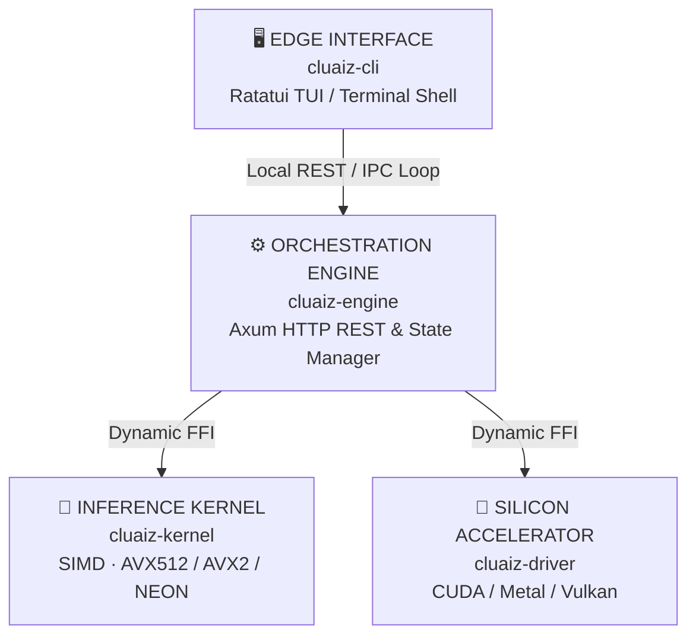

# System Architecture Overview

cluaiz is designed as a decoupled, multi-tier runtime stack to guarantee UI fluidity, memory-safe execution boundaries, and dynamic hardware offloading.

---

## 🏛️ Layered Topology

### 💻 Client Layer (`Apps/cli`)
The interactive terminal dashboard drawing widgets via Ratatui.
* **Onboarding Init:** Generates basic workstation directories (`~/.cluaiz/workspace/`) and configuration profiles.
* **Non-blocking Event Loop:** Resolves keyboard triggers and redraws UI components asynchronously, catching token packets via Server-Sent Events (SSE).

### 🧠 Core Engine Layer (`cluaiz-engine`)
The system manager built on Axum web server and Tokio async schedulers.
* **Scheduler Core:** Evaluates pipeline priority constraints, handles KV-cache lifecycle swaps, and coordinates async queues.
* **Optimization Registry:** Enforces active limits inside `system_booster.json` to prevent GPU memory depletion or driver conflicts.

### 🔌 Driver Bridge Layer
* **Dynamic Silicon Dispatch:** Scans system resources at boot to resolve dynamic driver bindings (`.dll` / `.so`).
* **Safe Fallbacks:** Maps math operators to SIMD instructions when dedicated accelerators are absent or depleted.
